# Phase 1 Operations

> [!WARNING]
> Archived migration source. Current procedures are owned by the
> [Phase 1 Local Runbook](../../08-operations/runbook.md).

> [!NOTE]
> Runtime architecture moved to
> [`02-architecture/runtime.md`](../../02-architecture/runtime.md). This file remains
> the transitional source for exact configuration and runbook behavior until the
> specification and operations milestones are accepted.
> The [proposed Phase 1 Local Runbook](../../08-operations/runbook.md) extracts only
> currently executable procedures and explicitly marks unavailable interfaces.

## Current status

Phase 1 is under implementation and is not deployed. The retained prototype is
reference evidence, not the active runtime.

## Configuration

> [!NOTE]
> Exact configuration fields, defaults, validation, and precedence are owned by
> the [Configuration Specification](../../03-specifications/configuration.md). This
> section remains a compatibility source and runbook precursor; do not edit its
> configuration contract independently.

- `config/host.yaml`: WSL host identity, vault path, runtime path, and Codex
  rollout store. This file is local and ignored.
- `System/Orca Memory/orca-memory.yaml`: Phase 1 schema, cadence, recall and
  processor budgets, provider, privacy policy, interaction-profile policy, and
  configurable interaction-guidance budget inside the local vault.
- Orca Project Registry: the collection of each project's `project.md`, holding
  permanent project IDs and unique human-readable aliases inside the local
  vault. Its local index is rebuildable; there is no separate `registry.md`.
  Machine-specific Project Root Mappings remain in local host configuration or
  runtime state and are not synchronized.

Configuration validation is deterministic and performs no model call.
Run Manifest and checkpoint publication follows the normative
[Provenance Ledger Specification](../../03-specifications/provenance-ledger.md).

The Phase 1 budget defaults are normative and configurable in
`System/Orca Memory/orca-memory.yaml`:

```yaml
budgets:
  processor:
    model_window_tokens: 32768
    input_tokens: 20000
    output_tokens: 4000
    new_evidence_tokens: 8000
    preceding_overlap_tokens: 1000
    continuation_summary_tokens: 2000
    project_summary_tokens: 2000
    related_records_tokens: 5000
    max_related_records: 5
  recall:
    total_tokens: 4000
    per_document_tokens: 1500
    exact_continuation_tokens: 2000
    max_results: 6
  interaction:
    auto_load_tokens: 500
```

Validation rejects configurations whose category ceilings cannot fit inside the
complete processor or recall ceiling. A larger provider context window does not
silently increase Orca's injected context.

## Normal operation

```mermaid
flowchart LR
    A[Start a Codex conversation] --> B[Load applicable interaction preferences]
    B --> D[Work in the active conversation]
    D -. explicit recall skill .-> C[Retrieve bounded relevant memory]
    C -. return labelled context .-> D
    D --> E[PreCompact or SessionEnd]
    E --> F[Prepare rollout pointer or secure retry spool]
    F --> Q[Queue work and trigger one-shot worker]
    Q --> G[Obtain and deduplicate normalized source]
    G --> H[Process transient Conversation Evidence]
    H --> I[Store outputs and Run Manifest]
    I --> J[Advance local checkpoint last]
    J --> K[Make outputs available to later recall]
```



### 1. Start a new conversation in Codex

1. On startup, resume, and post-compaction continuation, Orca loads the
   applicable global and Codex interaction preferences.
2. Codex receives that bounded presentation guidance and begins the active
   conversation.
3. Orca does not automatically recall project or topic memory.
4. When memory context is needed, Codex or the Owner explicitly invokes the
   recall skill with a query. Recall returns up to six results selected by the
   explicit requested meaning and labelled by authority.

The Owner may explicitly invoke `$orca-save` to queue the active conversation
through the same one-shot worker before a lifecycle hook occurs. On success it
returns the stable `conv:<purpose>--<short-id>` reference, full conversation ID,
status, and processed-through turn. `$orca-recall <conv-ref>` returns an exact
continuation package: up to 2,000 tokens from that Conversation Continuation
Summary, up to 1,000 tokens from its Project Summary when applicable, and
relevant Typed Memory Record excerpts within the remaining 4,000-token total.
The exact Continuation Summary is the deliberate exception to the ordinary
1,500-token per-document ceiling.

An explicit recall request may name a Project Alias, which Orca resolves to its
permanent `project_id`. Startup still performs no automatic semantic recall and
does **not** process the new conversation or create Conversation Evidence.
Recall applies hard authority, visibility, project, and status filters before
ranking. A weak Canonical match cannot displace a strongly relevant Shallow
Memory match; among comparably relevant results, Canonical Memory appears first.
Ambiguous requests return fewer results or request refinement rather than guess.
The complete returned context is capped at 4,000 tokens including labels and
provenance, with at most 1,500 tokens from one document. Recall chooses directly
responsive passages, marks omissions, returns paths and available `memory_id`
values, and performs no additional LLM summarization call.

Interaction guidance uses this precedence, highest first:

1. Current Owner instruction.
2. Current-session adjustment.
3. Confirmed applicable preference.
4. Project-and-agent adaptive profile.
5. Project adaptive profile.
6. Codex adaptive profile.
7. Global adaptive profile.

Only active entries compile, using exact phrases from the
[Interaction Guidance Specification](../../03-specifications/interaction-guidance.md). Conflicting
entries produce no guidance. The combined configurable default is 500 tokens;
selection keeps higher-precedence complete sentences and never truncates one.

### 2. Process new conversation context

1. `PreCompact` and `SessionEnd` hooks perform only bounded deterministic handoff
   rather than semantic processing inside Codex.
2. For `SessionEnd`, the Connector reads unprocessed source records, normalizes
   genuine Owner prompts and steering as evidence, and includes only final or
   directly referenced assistant messages as context.
3. A versioned deterministic privacy gate applies explicit Owner controls first:
   explicitly private content is excluded and leaves only a content-free local
   receipt. System, tool, reasoning, injected, and ambiguous content is also
   excluded.
4. Versioned credential patterns locally replace obvious secret values while
   preserving useful surrounding context. The redaction-policy version travels
   with the normalized input so a future pattern change is treated as a policy
   revision rather than a source-integrity conflict.
5. Only the remaining permitted, redacted normalized evidence enters the private
   local retry spool before `SessionEnd` returns. A `PreCompact` job can instead
   point the worker at the agent-owned rollout.
6. The hook queues the prepared job and triggers a one-shot background worker.
7. A lightweight periodic catch-up discovers missed or interrupted work and
   triggers the same one-shot worker. A no-op catch-up makes no model call.
8. The worker obtains transient normalized Conversation Evidence from the Codex
   rollout or retry spool after the saved checkpoint; it creates no permanent
   raw archive. The same Connector and privacy contract applies when the worker
   reads the rollout.
9. Governance resolves the normalized project root through the host-local mapping
   and permanent Project Registry. Recognized Git worktrees may reuse a mapping;
   moved folders and new clones require Owner-confirmed relinking when identity
   is not otherwise certain. Storage then hashes permitted normalized source
   together with its redaction-policy version and checks stable conversation and
   turn identities against durable Run Manifests, using a bounded in-memory
   lookup or an optional local processed-source projection.
10. Exact successful replays are skipped. Unknown source records proceed. A known
   source identity with a different hash under the same redaction-policy version
   fails closed as a source revision; a version change is a policy revision.
11. Processor builds one bounded semantic input from a capped chronological
   chunk of new evidence, minimal preceding-turn overlap, the current
   Conversation Continuation Summary, the current Project Summary when applicable, and a
   bounded same-scope set of relevant current Typed Memory Records. It never
   loads every prior conversation or every project record. Oversized backlogs
   become sequential runs with separate manifests and checkpoints; chunks split
   at turn boundaries when possible, while deterministic oversized-turn segments
   retain the original conversation and turn identities. The initial hard limit
   is 20,000 input tokens including instructions: 8,000 new-evidence tokens, one
   preceding turn up to 1,000 tokens, 2,000 Conversation Continuation Summary tokens, 2,000
   Project Summary tokens, and at most five related records totalling 5,000
   tokens. Output is capped at 4,000 tokens. New evidence is split rather than
   silently truncated, and lowest-ranked related records are removed first.
12. The semantic pass updates the conversation's own Conversation Continuation Summary and
   proposes controlled typed Shallow Memory records, candidates, and untrusted
   Interaction Observation Proposals. A proposal requires the Owner feedback,
   evaluated assistant response or passage, preceding request, applicable scope,
   and one of the six controlled contexts under the
   [Interaction Preference Specification](../../03-specifications/interaction-preferences.md).
   Deterministic validation either
   admits a compact reference-only observation into the Run Manifest or records
   an applicable content-free abstention. Related project records share one Project Memory
   scope; B1/B2/B3-style workstreams are relationship labels within it. A valid
   `no_memory` result still produces a successful Run Manifest.
13. For each proposed typed record, matching stays within one scope and uses its
   kind, normalized subject or entity, and provenance to retrieve bounded
   possible targets. The Processor proposes `add`, `support`, `update`,
   `supersede`, `conflict`, or `abstain` against an existing permanent
   `memory_id`; uncertain matches remain separate rather than being merged.
14. Exact support-only evidence writes a successful Run Manifest and advances
   the source checkpoint without rewriting the logical memory or advancing its
   source or Storage timestamps. Confirmed changed information revises the
   memory. Deterministic validation rejects missing targets, cross-scope matches,
   and attempts to change an existing memory's identity or scope.
   A current record publishes its kind-appropriate meaning under required
   `## Current`, with optional nonempty `## Context` and `## Implications`.
   Closed records use `## Final` and `## Closure`; provenance and unrelated
   logical memories do not enter these body sections.
15. When otherwise matching records conflict, validation makes a later position
   current only when a trusted Owner turn clearly states or confirms it as the
   applicable replacement; it retains the older position as superseded with
   provenance. Trusted source-turn timestamps may establish chronology across
   conversations on the same host, but turn IDs order records only inside their
   own conversation. Copied branch-prefix turns retain their original identity,
   hash, and time. Conversation creation and derived-record write times are not
   recency signals. Exploratory, hypothetical, quoted, or ambiguous later turns,
   and equal, missing, untrusted, or incomparable timestamps, preserve every
   distilled variant under one logical memory, mark a Memory Conflict, and
   select no current variant.
   Storage assigns stable record-local variant identifiers `v1`, `v2`, and so on
   in first-publication order; it never reuses or renumbers them. Processor may
   target one for support or resolution but cannot assign a new identifier.
   Record status is `current`, `conflict`, or `closed`; closed memory is excluded
   from ordinary Recall unless the request explicitly asks for inactive history.
   Every conflict, including a two-position conflict, is available when the Owner
   explicitly invokes the review skill. The third active position marks review
   urgent but creates no startup notification or automatic memory injection. A
   future dashboard or scheduled memory-health report may expose that urgency;
   it is outside the current operation flow.
   The default review shows concise summaries of all active and overflow
   positions with variant IDs, position timestamps, and support weights. It
   expands full distilled content and audit references only at the Owner's
   request. The Owner may select one variant, supply the resolving position, or
   keep the conflict unresolved. A resolution restores current status and keeps
   compact variant dispositions; complete evidence remains in Run Manifests.
   Review state is `none`, `required`, `acknowledged`, or `overflow` and affects
   urgency, not eligibility. Three active variants require urgent review. Every
   later distinct position beginning with `v4` is recorded as a durable overflow
   candidate, and processing continues for `v5+` and supporting evidence. Keeping
   a conflict unresolved acknowledges it only when no overflow exists; resolution
   restores `current` plus `none`.
   Each overflow candidate is a redacted `orca-conflict-overflow/0.1` Markdown
   artifact identified by `(memory_id, variant_id)` under the applicable
   `candidates/conflicts/` scope. Support-only evidence remains in Run Manifests;
   candidates are excluded from summaries and ordinary retrieval and persist
   without age-based retention until explicit resolution.
16. If current project records changed materially, Processor refreshes the one
   bounded Project Summary from its previous version, changed records, and a
   bounded set of related current records. It references their `memory_id`
   values, shows unresolved Memory Conflicts, and omits superseded details from
   the main overview. Conflict resolution replaces the conflict with applicable
   current meaning while retaining the same supporting `memory_id`; keeping a
   reviewed conflict unresolved does not rewrite the summary. A no-change run
   leaves the summary untouched.
17. Before publication, Storage deterministically scans every proposed output.
   Any affected output containing a credential-like value is rejected and cannot
   be stored or indexed.
18. Deterministic consolidation groups accepted observations by distinct source
   conversation, scope, context, dimension, direction or value, source-turn
   time, and policy version. It updates only affected living profiles: explicit
   lasting preferences activate immediately; otherwise three distinct
   conversations inside 180 days activate an entry; incompatible qualified
   evidence creates a conflicting entry; inferred entries expire after 180 days
   without reinforcement. Storage publishes the complete outputs and durable
   Run Manifest.
19. The local source checkpoint advances last, then the corresponding retry
   spool is deleted. Durable Run Manifests are authoritative for processed-source
   and `memory_id` audit lookup. Phase 1 can scan relevant date-sharded Manifests;
   an optional local SQLite projection may accelerate processed-source, memory
   audit, and interaction-observation lookups. The
   projection stores no raw conversation text, is never synchronized, and is
   disposable and rebuildable. Typed Memory Records duplicate none of that
   provenance.
20. Recall deterministically projects configured canonical and shallow Markdown
    before retrieval indexing. Current records expose current meaning; unresolved
    conflicts expose labelled variants; resolved lineage is omitted from ordinary
    search. Each indexed projection binds the source `memory_id`, authority,
    scope, status, source-file content hash, and projection-policy version.
    Reconciliation replaces the prior identity rather than adding a second copy.
21. A later explicit recall-skill invocation can return the new memory when it
    is among the six strongest results for the explicit request. Results remain
    authority-labelled; Interaction Preferences continue to load automatically
    and separately at session start.

### Conflict-resolution recovery

Owner resolution is not rolled back merely because a derived Project Summary,
Workstream Summary, or retrieval projection cannot refresh. Storage publishes
the validated resolved record and a Run Manifest that marks each failed derived
view stale. Recall excludes stale summaries and any indexed projection whose
source content hash no longer matches the current Markdown. A later bounded
summary rebuild and index reconciliation clear the stale state. When all proposed
artifacts are ready together, Storage publishes them recoverably with the Run
Manifest last; retrieval reconciliation remains a disposable follow-up.

After a resolution manifest records every active and overflow disposition,
Storage removes resolved overflow candidate files idempotently. A leftover file
after interrupted cleanup is ignored because the latest resolved lineage and Run
Manifest are authoritative for its disposition. Keeping the conflict unresolved
performs no candidate cleanup.

## Scheduling

Codex lifecycle hooks queue work and trigger a one-shot background worker before
compaction and at session end. Windows Task Scheduler invokes lightweight
periodic catch-up and index reconciliation. No permanent daemon is required.

## Failure behavior

- Partial trailing JSONL waits for a later processing run.
- Schema drift and ambiguous content fail closed. Private turns are excluded and
  leave only content-free local receipts. Obvious credential values are redacted
  locally before distillation; proposed outputs with credential-like values are
  rejected before storage or indexing.
- Lock contention exits without processing.
- Invalid semantic output leaves the agent-owned source and local checkpoint
  unchanged for retry. A `SessionEnd` retry spool uses fixed secure permissions
  and receives at most three automatic attempts. Its content is deleted after
  success or after a configurable retention period that defaults to 72 hours;
  terminal failure retains only a content-free local receipt.
- Invalid or contradictory interaction output does not silently broaden or
  confirm the adaptive profile.
- Index failure leaves Markdown untouched and requires reconciliation or rebuild.
- Exact replay is a no-op, including an old Codex session supplied after local
  checkpoints were lost, because durable Run Manifests rebuild deduplication
  state.

## Phase 1 readiness

Before routine use, verify Codex Desktop WSL startup, resume, fork, subagent,
partial-line, archive, schema drift, final-response classification, replay,
private-session exclusion, secret redaction, generated-output secret rejection,
restart, index rebuild, bounded
recall, scoped interaction learning, correction and decay behavior, no sensitive
trait inference, and zero canonical mutation.
