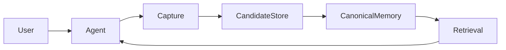
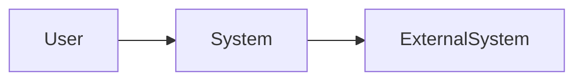
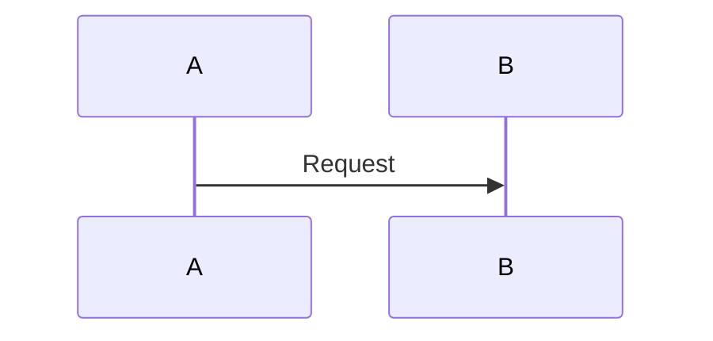

# Project Documentation Standard (PDS) v0.2

> A docs-as-code information architecture and governance standard for software and system projects developed by humans and AI agents.

## Document status

This is **PDS v0.2**, an internal house standard intended for adoption, testing, and refinement across future projects.

A project follows this standard only when it explicitly declares the PDS version and documentation profile in `docs/README.md`.

## What changed in PDS v0.2

PDS v0.2 adds and clarifies:

- `docs/ROADMAP.md` as the canonical owner of project direction and future phases.
- A formal distinction between roadmap, current status, active plans, proposals, and release history.
- An explicit definition of the project’s **system design package**.
- `docs/02-architecture/overview.md` as the primary system-design entry point.
- Data architecture requirements for data-centric systems.
- Security and trust documentation requirements for sensitive, connected, or agentic systems.
- Updated repository structure, templates, reading routes, agent rules, migration rules, and review checks.

---

## Table of contents

1. [Purpose](#1-purpose)
2. [Scope](#2-scope)
3. [Normative language](#3-normative-language)
4. [Core principles](#4-core-principles)
5. [Documentation truth model](#5-documentation-truth-model)
6. [The PDS system-design model](#6-the-pds-system-design-model)
7. [Documentation profiles](#7-documentation-profiles)
8. [Standard repository structure](#8-standard-repository-structure)
9. [The five navigation entry points](#9-the-five-navigation-entry-points)
10. [Canonical document types](#10-canonical-document-types)
11. [Document metadata](#11-document-metadata)
12. [Document status and authority](#12-document-status-and-authority)
13. [Canonical ownership](#13-canonical-ownership)
14. [Cross-linking and traceability](#14-cross-linking-and-traceability)
15. [File naming and identifiers](#15-file-naming-and-identifiers)
16. [Document lifecycle](#16-document-lifecycle)
17. [Rules for creating documents](#17-rules-for-creating-documents)
18. [Rules for updating documentation](#18-rules-for-updating-documentation)
19. [Human reading routes](#19-human-reading-routes)
20. [AI agent protocol](#20-ai-agent-protocol)
21. [Working notes and archives](#21-working-notes-and-archives)
22. [Roadmap documentation](#22-roadmap-documentation)
23. [Architecture and system-design documentation](#23-architecture-and-system-design-documentation)
24. [Data architecture](#24-data-architecture)
25. [Security and trust documentation](#25-security-and-trust-documentation)
26. [Requirements and specifications](#26-requirements-and-specifications)
27. [Architecture Decision Records](#27-architecture-decision-records)
28. [Proposals](#28-proposals)
29. [Plans and project status](#29-plans-and-project-status)
30. [Quality and verification](#30-quality-and-verification)
31. [Operations documentation](#31-operations-documentation)
32. [User documentation](#32-user-documentation)
33. [Changelog and release documentation](#33-changelog-and-release-documentation)
34. [Documentation validation](#34-documentation-validation)
35. [Conformance and exceptions](#35-conformance-and-exceptions)
36. [Adopting PDS in a new project](#36-adopting-pds-in-a-new-project)
37. [Migrating an existing project](#37-migrating-an-existing-project)
38. [Common anti-patterns](#38-common-anti-patterns)
39. [Maintaining PDS](#39-maintaining-pds)
40. [Appendix A: Quick reference](#appendix-a-quick-reference)
41. [Appendix B: Core templates](#appendix-b-core-templates)
42. [Appendix C: Review checklist](#appendix-c-review-checklist)

---

# 1. Purpose

PDS defines a predictable documentation system in which:

- every important project subject has one canonical owner;
- every document has a clear and limited purpose;
- accepted design is separated from proposals, plans, history, and working notes;
- system architecture and detailed system design are easy to locate;
- future project direction is separated from current implementation work;
- humans can understand a project without reconstructing it from scattered files;
- AI agents can find authoritative context without loading the entire repository;
- documentation changes are traceable to requirements, decisions, implementation, and tests;
- stale or conflicting documentation is visible rather than silently treated as truth.

PDS is not merely a folder layout.

It defines:

1. **Information architecture**  
   Where each type of information belongs.

2. **Document contracts**  
   What each document owns and must not own.

3. **Authority rules**  
   Which documents may define accepted project truth.

4. **Lifecycle rules**  
   How ideas move from exploration to proposal, decision, implementation, operation, and history.

5. **Navigation rules**  
   How humans and agents enter and traverse the documentation.

6. **Change obligations**  
   Which documents must be considered when the system changes.

7. **Validation rules**  
   How documentation drift and disorder are detected.

---

# 2. Scope

PDS is intended for:

- software projects;
- system-integration projects;
- infrastructure projects;
- data systems;
- AI and agent systems;
- automation systems;
- internal developer platforms;
- local-first tools;
- distributed services;
- mixed technical projects maintained in a version-controlled repository.

PDS is especially suitable when:

- more than one person or agent may work on the project;
- the project continues across many sessions;
- design decisions need to remain understandable months later;
- specifications and implementation may temporarily diverge;
- multiple agents need a shared, agent-neutral source of project knowledge;
- project direction spans several phases;
- data ownership, provenance, privacy, or synchronization are important;
- project documentation is maintained as Markdown beside the code.

PDS does **not** prescribe:

- a programming language;
- a development methodology;
- a ticketing system;
- a particular diagram tool;
- a particular CI platform;
- a particular project management product;
- a fixed number of documents for every project;
- a replacement for source code;
- a replacement for automated tests;
- a replacement for issue tracking;
- a replacement for release management.

PDS is designed to work alongside those systems.

---

# 3. Normative language

The terms below indicate requirement strength:

- **MUST** — required for conformance.
- **MUST NOT** — prohibited for conformance.
- **SHOULD** — strongly recommended; deviations require a clear reason.
- **SHOULD NOT** — normally prohibited; deviations require a clear reason.
- **MAY** — optional.

Examples and templates in this standard are informative unless a rule explicitly says they are required.

---

# 4. Core principles

## 4.1 One canonical owner per subject

Every important project subject MUST have one canonical document that owns its definition.

Other documents MAY summarize that subject, but they MUST link to the canonical owner and MUST NOT redefine it independently.

Example:

```text
Memory record fields
    → memory-model specification owns the definition

Architecture overview
    → may summarize the record at a high level
    → must link to the specification
    → must not maintain a competing field list
```

## 4.2 Predictable entry points

Every PDS project MUST provide predictable entry points for:

- human orientation;
- agent instructions;
- documentation navigation;
- current project state;
- future project direction where a roadmap is required.

These are defined in [Section 9](#9-the-five-navigation-entry-points).

## 4.3 Separate kinds of truth

PDS separates:

```text
Accepted project purpose and intent
    → charter and requirements

Accepted system structure
    → architecture

Exact accepted behavior
    → specifications

Rationale for accepted choices
    → ADRs

Future direction
    → roadmap

Unaccepted future change
    → proposals

Implementation work in progress
    → active plans

Current implementation snapshot
    → STATUS.md, code, and tests

Released changes
    → CHANGELOG.md or release records

Temporary exploration
    → _working/

Superseded or inactive material
    → _archive/
```

These categories MUST NOT be presented as interchangeable.

## 4.4 Link instead of duplicate

A document SHOULD summarize only enough related information to remain understandable, then link to the canonical owner.

Copying large normative sections across files is prohibited because copies drift.

## 4.5 Human-readable first

Canonical documentation MUST remain understandable in an ordinary Markdown renderer or text editor.

Machine-readable metadata, schemas, indexes, and validators MAY be added, but they MUST support human comprehension rather than replace it.

## 4.6 Minimal sufficient documentation

Projects MUST create the documentation required to make the project understandable and governable.

Projects MUST NOT create empty or meaningless documents merely to imitate the full folder tree.

Conditional documents should be added when the project earns their complexity or when a trigger in this standard applies.

## 4.7 Explicit uncertainty

Unknown, disputed, proposed, exploratory, and divergent information MUST be labelled explicitly.

An engineer or agent MUST NOT silently convert uncertainty into accepted fact.

## 4.8 Documentation changes with the system

Documentation is part of the engineering change surface.

A change is not complete when required documentation, decisions, tests, roadmap state, or runbooks remain knowingly stale.

## 4.9 Agent-neutral project knowledge

Canonical project knowledge MUST live in agent-neutral project documents.

Agent-specific files may route agents to the documentation, but MUST NOT become separate copies of the architecture, roadmap, requirements, or specifications.

## 4.10 Preserve history without obscuring the present

Historical rationale should remain available, but normal navigation MUST lead to current accepted documents first.

## 4.11 System design is a document set, not necessarily one giant file

PDS treats system design as a coordinated package of documents rather than one mixed document.

The primary entry point is the architecture overview.

Detailed design belongs in specifications and related documents.

## 4.12 Future direction is not current work

The roadmap describes major future outcomes and sequencing.

The active plan describes immediate execution.

The two MUST NOT be used as substitutes for each other.

---

# 5. Documentation truth model

PDS does not treat one file as the source of truth for every question.

Different documents own different dimensions of truth.

| Question                                      | Canonical source                    |
| --------------------------------------------- | ----------------------------------- |
| Why does the project exist?                   | Project charter                     |
| What must the system accomplish?              | Requirements                        |
| Where is the project heading?                 | Roadmap                             |
| What is implemented now?                      | Code, tests, and `STATUS.md`        |
| How is the accepted system divided?           | Architecture                        |
| Exactly how must a behavior or contract work? | Specification                       |
| Why was an important choice made?             | ADR                                 |
| What substantial change is being considered?  | Proposal                            |
| What work is currently being executed?        | Active plan                         |
| What changed in released versions?            | Changelog or release records        |
| How is behavior proven?                       | Quality documents and tests         |
| How is the system run or recovered?           | Runbook                             |
| What was explored but not accepted?           | Working notes or archived proposals |

## 5.1 Intended design versus implementation reality

Requirements, architecture, and specifications define accepted project intent.

Code and tests show implementation reality.

`docs/STATUS.md` summarizes the relationship between the two.

When accepted documentation and implementation disagree, the project MUST NOT silently choose one as correct.

The difference MUST be recorded as a known divergence until it is resolved.

Example:

```yaml
status: accepted
authority: normative
implementation_status: diverged
```

This means:

> The document still defines accepted intent, but the implementation does not currently conform to it.

## 5.2 Future direction versus accepted system design

The roadmap describes intended project evolution.

It does not automatically define exact system behavior.

A roadmap phase may be:

- committed;
- candidate;
- exploratory;
- deferred.

Only accepted requirements, architecture, specifications, and ADRs define accepted system design.

## 5.3 Historical records are evidence, not current truth

ADRs, completed plans, incident reports, changelogs, and archived documents can explain how the project reached its current state.

They MUST NOT override a current canonical document unless that document explicitly incorporates them.

## 5.4 Working notes are non-authoritative

Conversation summaries, scratch files, audits, design explorations, and handoffs MAY contain useful evidence.

They MUST NOT be treated as accepted project truth unless their conclusions are promoted into the correct canonical document.

## 5.5 Canonical does not always mean normative

Some documents are canonical for a subject without defining system behavior.

Examples:

- `STATUS.md` is the canonical project-state summary but is informative.
- `ROADMAP.md` is the canonical project-direction summary but is informative.
- An ADR is the canonical rationale record but is historical.
- A specification is canonical and normative for exact behavior.

---

# 6. The PDS system-design model

## 6.1 Definition

Under PDS, the project’s **system design** is represented collectively by:

```text
Project Charter
    Why the system exists and its boundaries

Requirements
    What the system must accomplish

Architecture
    High-level structure, boundaries, responsibilities, and flows

Specifications
    Exact component, workflow, data, and interface behavior

ADRs
    Why important design decisions were made

Quality Documentation
    How the design is verified

Operations Documentation
    How the implemented design is run and recovered
```

No single document is expected to contain all of this information.

## 6.2 Primary system-design entry point

The primary system-design entry point MUST be:

```text
docs/02-architecture/overview.md
```

Its recommended human-facing title is:

```markdown
# System Architecture and Design Overview
```

Projects MAY use:

```markdown
# Architecture Overview
```

but the document MUST clearly state that it is the primary entry point to the system design.

## 6.3 Why PDS does not require one giant `system-design.md`

A single large system-design document often mixes:

- purpose;
- requirements;
- architecture;
- data schemas;
- technical decisions;
- implementation plans;
- progress;
- unresolved ideas;
- testing;
- operations.

That structure becomes difficult to maintain and difficult for agents to interpret.

PDS instead provides one clear entry point and delegates detail to canonical owners.

## 6.4 System-design navigation

A typical system-design reading route is:

```text
System Architecture and Design Overview
    ├── Requirements
    ├── Data Architecture
    ├── Security and Trust
    ├── Runtime Architecture
    ├── Detailed Specifications
    ├── ADRs
    ├── Quality and Acceptance
    └── Runbook
```

## 6.5 System-design completeness

A system design is considered sufficiently documented when a competent engineer can answer:

- What problem does the system solve?
- What is in scope and out of scope?
- What are the major requirements?
- What are the major components?
- What does each component own?
- How do components interact?
- Where does data originate and remain authoritative?
- What are the important runtime flows?
- What exact contracts must be implemented?
- Why were significant design choices made?
- What are the major risks and trust boundaries?
- How is the design tested?
- How is the system deployed, operated, and recovered?

Not every answer must live in the architecture overview, but the overview MUST route the reader to the canonical answer.

---

# 7. Documentation profiles

Projects vary in size.

PDS defines three profiles.

## 7.1 Minimal profile

Suitable for experiments, small tools, and short-lived repositories.

Required:

```text
README.md
AGENTS.md
docs/README.md
docs/STATUS.md

docs/01-foundation/
    project-charter.md

docs/02-architecture/
    overview.md

docs/06-plans/
    active/

docs/_working/
docs/_archive/
```

`docs/ROADMAP.md` is optional for the Minimal profile.

If it is omitted, `docs/README.md` MUST state:

```text
This project has no separate roadmap because it is a single bounded phase.
```

Requirements, specifications, ADRs, quality documents, and runbooks are added when relevant.

## 7.2 Core profile

Suitable for most maintained software, automation, data, and AI-agent projects.

Required:

```text
README.md
AGENTS.md
docs/README.md
docs/STATUS.md
docs/ROADMAP.md

docs/01-foundation/
    project-charter.md
    requirements.md
    glossary.md

docs/02-architecture/
    overview.md
    diagrams/

docs/03-specifications/
    README.md
    one or more specifications

docs/04-decisions/
    README.md
    template.md
    ADR records

docs/05-proposals/
    README.md
    template.md

docs/06-plans/
    README.md
    active/
    completed/

docs/07-quality/
    acceptance.md
    test-strategy.md

docs/08-operations/
    runbook.md

docs/_working/
docs/_archive/
```

## 7.3 Extended profile

Suitable for larger, deployed, regulated, security-sensitive, or multi-team systems.

It includes the Core profile and may add:

```text
CHANGELOG.md

docs/02-architecture/
    runtime.md
    deployment.md
    data-architecture.md
    security-and-trust.md
    integration-architecture.md
    reliability.md

docs/07-quality/
    traceability.md
    performance.md
    reliability.md
    security-testing.md
    evaluation-strategy.md

docs/08-operations/
    troubleshooting.md
    backup-and-restore.md
    incident-response.md
    monitoring.md
    disaster-recovery.md

docs/09-user-docs/
    tutorials/
    how-to/
    reference/
    explanation/

schemas/
api/
threat-model/
```

## 7.4 Triggered documents

Some documents are conditional by project type rather than documentation profile.

### Data architecture trigger

`docs/02-architecture/data-architecture.md` MUST be created when any of the following apply:

- the system uses multiple persistent stores;
- canonical and derived data are separated;
- data retention or deletion matters;
- provenance or audit history matters;
- data is synchronized across services or machines;
- schema migration is significant;
- data ownership is central to the architecture;
- the same information exists in multiple representations;
- recovery requires rebuilding derived data.

### Security and trust trigger

`docs/02-architecture/security-and-trust.md` MUST be created when any of the following apply:

- the system stores personal or sensitive information;
- the system processes credentials or secrets;
- the system calls external services or models;
- the system accepts untrusted input;
- the system has authentication or authorization;
- the system can execute tools or modify external systems;
- the system is network accessible;
- the system supports multiple users;
- the system synchronizes across machines;
- unauthorized access could cause material harm.

### Roadmap trigger

`docs/ROADMAP.md` MUST be created when:

- the project has more than one intended phase;
- major capabilities are intentionally deferred;
- future integrations are planned;
- future architecture will differ materially;
- several teams or agents need a shared view of direction.

## 7.5 Profile declaration

Every project MUST declare its profile in `docs/README.md`:

```yaml
---
documentation_standard: PDS-0.2
documentation_profile: core
---
```

Projects MAY use a customized profile, but exceptions MUST be recorded.

---

# 8. Standard repository structure

A Core-profile project should normally use:

```text
project/
├── README.md
├── AGENTS.md
├── CONTRIBUTING.md                     # Optional
├── CHANGELOG.md                        # Conditional
│
├── docs/
│   ├── README.md
│   ├── STATUS.md
│   ├── ROADMAP.md
│   │
│   ├── 01-foundation/
│   │   ├── project-charter.md
│   │   ├── requirements.md
│   │   └── glossary.md
│   │
│   ├── 02-architecture/
│   │   ├── overview.md
│   │   ├── runtime.md                  # Conditional
│   │   ├── deployment.md               # Conditional
│   │   ├── data-architecture.md        # Triggered
│   │   ├── security-and-trust.md       # Triggered
│   │   ├── integration-architecture.md # Conditional
│   │   └── diagrams/
│   │       ├── system-context.mmd
│   │       ├── containers.mmd
│   │       └── important-flow.mmd
│   │
│   ├── 03-specifications/
│   │   ├── README.md
│   │   └── <capability-or-contract>.md
│   │
│   ├── 04-decisions/
│   │   ├── README.md
│   │   ├── template.md
│   │   └── 0001-short-decision-title.md
│   │
│   ├── 05-proposals/
│   │   ├── README.md
│   │   ├── template.md
│   │   └── 0001-short-proposal-title.md
│   │
│   ├── 06-plans/
│   │   ├── README.md
│   │   ├── active/
│   │   └── completed/
│   │
│   ├── 07-quality/
│   │   ├── acceptance.md
│   │   ├── test-strategy.md
│   │   ├── traceability.md             # Conditional
│   │   └── evaluation-strategy.md      # Conditional
│   │
│   ├── 08-operations/
│   │   ├── runbook.md
│   │   ├── troubleshooting.md          # Conditional
│   │   ├── backup-and-restore.md       # Conditional
│   │   └── monitoring.md               # Conditional
│   │
│   ├── 09-user-docs/                   # Conditional
│   │   ├── tutorials/
│   │   ├── how-to/
│   │   ├── reference/
│   │   └── explanation/
│   │
│   ├── _working/
│   │   └── README.md
│   │
│   └── _archive/
│       └── README.md
│
├── schemas/                             # Conditional
├── api/                                 # Conditional
├── src/
├── tests/
└── scripts/
```

## 8.1 Numbered documentation folders

Numbered folders provide a stable conceptual order:

```text
01  Foundation
02  Architecture and system design
03  Detailed specifications
04  Decisions
05  Proposals
06  Plans
07  Quality
08  Operations
09  User documentation
```

The numbers indicate reading and responsibility order, not priority.

## 8.2 Unnumbered control documents

These remain at the top of `docs/` because they are navigation and project-control documents:

```text
docs/README.md
docs/STATUS.md
docs/ROADMAP.md
```

## 8.3 Conditional files

A project MUST NOT create a file solely because it appears in the example tree.

A conditional document should be created only when:

- it has a clear owner;
- it contains material that does not belong in another canonical document;
- it will be maintained;
- it improves understanding or governance;
- or a triggered-document rule applies.

---

# 9. The five navigation entry points

Core and Extended PDS projects MUST provide five predictable navigation entry points.

## 9.1 Root `README.md`

Purpose:

> Human orientation and quick start.

It SHOULD answer:

- What is the project?
- Why does it exist?
- What phase or maturity is it in?
- How do I install or run it?
- Where does the detailed documentation begin?
- Where is the current status?
- Where is the roadmap?
- Where are contribution and support instructions?

It MUST NOT become the full architecture, specification, roadmap, or active project plan.

Recommended structure:

```markdown
# Project Name

One-paragraph description.

## Current status

Short project maturity statement.

## Capabilities

Concise current capabilities.

## Quick start

Installation and execution commands.

## Documentation

- [Documentation map](docs/README.md)
- [Current status](docs/STATUS.md)
- [Roadmap](docs/ROADMAP.md)
- [Project charter](docs/01-foundation/project-charter.md)
- [System architecture and design](docs/02-architecture/overview.md)

## Development

Build, test, and lint commands.
```

## 9.2 Root `AGENTS.md`

Purpose:

> Durable instructions for AI coding agents working in the repository.

It SHOULD contain:

- repository purpose;
- required reading order;
- build, test, and validation commands;
- coding conventions;
- documentation protocol;
- safety constraints;
- directory-specific guidance;
- change-completion expectations.

It MUST NOT duplicate:

- the project roadmap;
- architecture;
- detailed system design;
- requirements;
- specifications.

It MUST point agents to:

```text
docs/README.md
docs/STATUS.md
docs/ROADMAP.md
```

## 9.3 `docs/README.md`

Purpose:

> Documentation registry, authority map, and reading router.

It MUST contain:

- PDS version and profile;
- current documentation reading order;
- canonical owner for each major subject;
- task-based reading routes;
- a current document registry;
- non-authoritative folder warnings;
- project-specific exceptions;
- unresolved documentation governance issues.

## 9.4 `docs/STATUS.md`

Purpose:

> Concise current project and implementation state.

It SHOULD contain:

- current phase;
- implemented capabilities;
- partially implemented capabilities;
- designed but unimplemented capabilities;
- known design–implementation divergence;
- active plans;
- open decisions;
- current blockers;
- last repository verification date.

It MUST NOT redefine:

- requirements;
- architecture;
- specifications;
- roadmap direction.

## 9.5 `docs/ROADMAP.md`

Purpose:

> Canonical description of the project’s intended evolution across major phases and outcomes.

It SHOULD contain:

- current and future phases;
- outcome of each phase;
- broad sequencing;
- phase status;
- major dependencies;
- exit criteria;
- intentionally deferred capabilities;
- committed versus exploratory distinctions;
- links to active plans and proposals.

It MUST NOT contain:

- detailed task checklists;
- exact behavioral specifications;
- implementation progress details;
- unlabelled speculative ideas;
- promises of dates that have not been formally committed.

---

# 10. Canonical document types

## 10.1 Responsibility matrix

| Document           | Owns                                                              | Must not own                                        |
| ------------------ | ----------------------------------------------------------------- | --------------------------------------------------- |
| Root `README.md`   | Orientation, quick start, primary links                           | Detailed design, roadmap detail, or active planning |
| `docs/README.md`   | Documentation navigation and authority map                        | System behavior                                     |
| `docs/STATUS.md`   | Current project and implementation snapshot                       | Normative design or future direction                |
| `docs/ROADMAP.md`  | Project phases, future outcomes, broad sequencing                 | Exact tasks, specifications, or current progress    |
| Project charter    | Purpose, goals, scope, non-goals, constraints                     | Detailed component behavior                         |
| Requirements       | What the system must accomplish                                   | Implementation structure                            |
| Glossary           | Canonical project terminology                                     | Behavior or architecture                            |
| Architecture       | Components, boundaries, responsibilities, flows, deployment       | Exact fields and implementation tasks               |
| Data architecture  | Data categories, ownership, lifecycle, stores, derived data       | Detailed business behavior                          |
| Security and trust | Assets, threats, trust boundaries, access, retention, mitigations | General implementation plan                         |
| Specification      | Exact behavior, contracts, schemas, states, invariants, errors    | Project scheduling                                  |
| ADR                | Rationale and consequences of one significant decision            | Full current architecture                           |
| Proposal           | Substantial unaccepted change                                     | Accepted current behavior                           |
| Plan               | Work sequence, milestones, dependencies, progress                 | Canonical requirements or architecture              |
| Quality document   | Acceptance criteria and verification strategy                     | Implementation design                               |
| Runbook            | Installation, execution, maintenance, recovery                    | Product rationale                                   |
| Changelog          | Released changes by version                                       | Future direction or active planning                 |
| User documentation | How users understand and use the system                           | Internal engineering plans                          |
| Working note       | Temporary exploration and evidence                                | Accepted project truth                              |
| Archive            | Historical and superseded material                                | Current guidance                                    |
| `AGENTS.md`        | Agent working protocol                                            | Canonical project design                            |

## 10.2 Project charter

The project charter owns:

- problem statement;
- intended users and stakeholders;
- project purpose;
- goals;
- non-goals;
- phase boundaries;
- constraints;
- success criteria;
- assumptions requiring validation.

The charter SHOULD remain relatively stable.

Detailed functional behavior belongs in requirements or specifications.

## 10.3 Roadmap

The roadmap owns:

- major phases;
- intended outcome of each phase;
- broad sequencing;
- dependencies among phases;
- future direction;
- deferred capabilities;
- phase entry and exit conditions;
- commitment level.

The roadmap does not own task execution.

## 10.4 Requirements

Requirements own externally meaningful obligations.

Requirements MAY include:

- functional requirements;
- quality requirements;
- compliance requirements;
- security requirements;
- operational requirements;
- data retention requirements;
- interoperability requirements.

Each important requirement SHOULD have a stable identifier.

## 10.5 Architecture

Architecture owns:

- system boundaries;
- external actors and systems;
- major components;
- component responsibilities;
- allowed dependencies;
- high-level data ownership;
- high-level runtime flows;
- deployment topology;
- trust boundaries;
- cross-cutting architectural principles;
- known architectural risks.

Architecture SHOULD link to exact specifications instead of reproducing them.

## 10.6 Data architecture

Data architecture owns:

- data categories;
- canonical stores;
- derived representations;
- ownership;
- lifecycle;
- retention;
- deletion;
- provenance;
- consistency;
- migration;
- synchronization;
- backup and recovery relationships.

## 10.7 Security and trust

Security and trust documentation owns:

- protected assets;
- threat assumptions;
- trust boundaries;
- identities and permissions;
- external-service risks;
- secret handling;
- sensitive-data handling;
- security invariants;
- mitigations;
- residual risk.

## 10.8 Specifications

A specification owns one exact behavior, interface, data model, workflow, or contract.

Examples:

```text
memory-model.md
capture-pipeline.md
retrieval-contract.md
provenance-ledger.md
configuration.md
synchronization-protocol.md
agent-integration-contract.md
```

A specification SHOULD be precise enough to implement and test.

## 10.9 Architecture Decision Records

Each ADR owns one significant accepted decision, including:

- context;
- decision;
- alternatives;
- consequences;
- status;
- supersession relationships.

An ADR explains **why**, while architecture and specifications describe the current accepted result.

## 10.10 Proposals

A proposal owns a substantial change that has not yet been accepted.

It may describe:

- motivation;
- goals and non-goals;
- proposed design;
- alternatives;
- risks;
- compatibility;
- migration;
- unresolved questions.

A proposal MUST NOT be treated as current project truth.

## 10.11 Plans

Plans own implementation execution:

- milestones;
- tasks;
- dependencies;
- sequencing;
- completion criteria;
- progress;
- blockers;
- rollout or migration steps.

Plans MUST link to the requirements, specifications, roadmap phase, and decisions they implement.

## 10.12 Quality documents

Quality documentation owns:

- acceptance criteria;
- test strategy;
- verification responsibility;
- traceability;
- performance criteria;
- reliability criteria;
- security verification;
- AI evaluation;
- release gates.

## 10.13 Operations documents

Operations documentation owns:

- installation;
- configuration;
- starting and stopping;
- health checks;
- maintenance;
- backup and restore;
- recovery;
- troubleshooting;
- incident handling;
- observability.

## 10.14 Changelog

A changelog owns:

- released version history;
- notable changes;
- migrations;
- deprecations;
- compatibility notes.

A changelog does not own future plans or current work.

---

# 11. Document metadata

Substantial documents SHOULD begin with YAML frontmatter.

Example:

```yaml
---
id: SPEC-MEMORY-MODEL
title: Memory Model Specification
document_type: specification
status: accepted
authority: normative
implementation_status: partial
applies_to:
  - phase-1
owners:
  - project-owner
last_reviewed: 2026-08-29
last_verified_against_code: 2026-08-29
supersedes: []
related:
  - REQ-004
  - ADR-0001
---
```

## 11.1 Standard fields

| Field                        |                      Required | Purpose                             |
| ---------------------------- | ----------------------------: | ----------------------------------- |
| `id`                         | Yes for substantial documents | Stable reference                    |
| `title`                      |                           Yes | Human-readable name                 |
| `document_type`              |                           Yes | Document responsibility             |
| `status`                     |                           Yes | Document lifecycle                  |
| `authority`                  |                           Yes | Whether it may define project truth |
| `implementation_status`      |               When applicable | Relation to implementation          |
| `applies_to`                 |                   Recommended | Phases, versions, or components     |
| `owners`                     |                   Recommended | Responsible maintainers             |
| `last_reviewed`              |                   Recommended | Last content review                 |
| `last_verified_against_code` |               When applicable | Last implementation comparison      |
| `supersedes`                 |               When applicable | Replaced records                    |
| `superseded_by`              |               When applicable | Current replacement                 |
| `related`                    |                      Optional | Stable related identifiers          |

## 11.2 Document type values

Recommended values:

```text
documentation-index
project-status
roadmap
project-charter
requirements
glossary
architecture
data-architecture
security
specification
decision
proposal
implementation-plan
quality
runbook
changelog
user-documentation
working-note
historical
```

Projects MAY add controlled values, but SHOULD document them in `docs/README.md`.

## 11.3 Purpose and ownership statement

After the title, every substantial document SHOULD include:

```markdown
## Purpose

What this document exists to define.

## This document owns

- Subject A
- Subject B

## This document does not own

- Related subject C
- Related subject D

## Related documents

- **Required by:** ...
- **Specified by:** ...
- **Decided by:** ...
- **Implemented through:** ...
- **Verified by:** ...
- **Roadmap phase:** ...
```

This is strongly recommended for AI-assisted repositories because it reduces accidental document overlap.

---

# 12. Document status and authority

PDS separates three dimensions.

## 12.1 Lifecycle status

Allowed values:

```text
draft
proposed
accepted
superseded
archived
```

Definitions:

- `draft` — incomplete or under preparation.
- `proposed` — formally available for review but not accepted.
- `accepted` — approved for its intended role.
- `superseded` — replaced by a newer document or decision.
- `archived` — inactive and retained for history.

## 12.2 Authority

Allowed values:

```text
normative
informative
historical
working
```

Definitions:

- `normative` — may define accepted project requirements or behavior.
- `informative` — explains, summarizes, or reports but does not define exact system behavior.
- `historical` — records past state, decisions, releases, or events.
- `working` — temporary, exploratory, and non-authoritative.

## 12.3 Implementation status

Allowed values:

```text
not-applicable
unknown
planned
partial
implemented
verified
diverged
```

Definitions:

- `not-applicable` — no direct implementation relationship.
- `unknown` — relationship has not been checked.
- `planned` — accepted but not started.
- `partial` — some required behavior exists.
- `implemented` — believed to be implemented.
- `verified` — checked against code and tests.
- `diverged` — known disagreement exists.

## 12.4 Status combinations

Examples:

```yaml
status: accepted
authority: normative
implementation_status: planned
```

Accepted design, not yet implemented.

```yaml
status: accepted
authority: normative
implementation_status: verified
```

Accepted design verified against implementation.

```yaml
status: accepted
authority: informative
implementation_status: not-applicable
```

An accepted roadmap or project-status document.

```yaml
status: proposed
authority: informative
implementation_status: not-applicable
```

A proposal under review.

```yaml
status: archived
authority: historical
implementation_status: not-applicable
```

A historical document.

```yaml
status: draft
authority: working
implementation_status: unknown
```

An exploratory working document.

---

# 13. Canonical ownership

## 13.1 Ownership rule

For every material subject, `docs/README.md` MUST identify one canonical owner.

Example:

| Subject                      | Canonical owner                         |
| ---------------------------- | --------------------------------------- |
| Project scope                | `01-foundation/project-charter.md`      |
| Functional requirements      | `01-foundation/requirements.md`         |
| Future phases                | `ROADMAP.md`                            |
| Current implementation state | `STATUS.md`                             |
| System component boundaries  | `02-architecture/overview.md`           |
| Data ownership and lifecycle | `02-architecture/data-architecture.md`  |
| Security boundaries          | `02-architecture/security-and-trust.md` |
| Memory record format         | `03-specifications/memory-model.md`     |
| Capture behavior             | `03-specifications/capture-pipeline.md` |
| Architectural rationale      | `04-decisions/`                         |
| Current implementation work  | `06-plans/active/`                      |
| Acceptance behavior          | `07-quality/acceptance.md`              |
| Local operation              | `08-operations/runbook.md`              |
| Released changes             | `/CHANGELOG.md`                         |

## 13.2 Summary versus redefinition

A non-owning document MAY include a short summary when necessary for comprehension.

It MUST link to the canonical owner.

Example:

```markdown
Canonical memories are stored as human-readable Markdown.

For exact record fields and lifecycle rules, see the
[Memory Model Specification](../03-specifications/memory-model.md).
```

It SHOULD NOT repeat the entire schema.

## 13.3 Conflicting owners

When two documents appear to own the same subject:

1. The conflict MUST be recorded.
2. Neither document should be silently chosen.
3. A canonical owner MUST be selected through review.
4. Unique information MUST be preserved.
5. Non-owning documents MUST be changed to summaries and links.
6. Historical material MUST be archived where appropriate.

## 13.4 Code as implementation authority

Code is authoritative evidence of what currently executes.

Code MUST NOT silently replace accepted requirements or architecture.

A discrepancy between code and accepted documentation is a divergence to resolve, not permission to rewrite one based on assumption.

## 13.5 Roadmap as direction authority

`ROADMAP.md` is the canonical owner of phase direction and major future outcomes.

It is not authoritative for exact technical behavior.

A roadmap statement MUST link to a proposal, requirement, or accepted design when exact technical meaning is needed.

---

# 14. Cross-linking and traceability

## 14.1 Semantic link labels

Links SHOULD state the relationship.

Recommended labels:

```text
Required by
Fulfills
Specified by
Decided by
Implements
Implemented through
Verified by
Depends on
Supersedes
Superseded by
Evidence
Related context
Operationalized by
Roadmap phase
Released in
```

Example:

```markdown
## Related documents

- **Fulfills:** [REQ-006](../01-foundation/requirements.md#req-006)
- **Decided by:** [ADR-0003](../04-decisions/0003-cache-ephemeral-judgments.md)
- **Roadmap phase:** [Phase 1](../ROADMAP.md#phase-1)
- **Implemented through:** [Phase 1 Plan](../06-plans/active/phase-1.md)
- **Verified by:** [TEST-CAPTURE-004](../07-quality/acceptance.md#test-capture-004)
```

## 14.2 Required links

A Core-profile project SHOULD satisfy:

1. Every current document is registered in `docs/README.md`.
2. Every substantial current document links back to `docs/README.md`.
3. Every specification links to relevant requirements.
4. Every significant accepted technical decision has an ADR.
5. Every active plan links to what it implements.
6. Every active plan links to its roadmap phase where applicable.
7. Every acceptance criterion links to a requirement or specification.
8. Every superseded document identifies its replacement.
9. Working notes are never linked as normative authority.
10. Relative repository links are used where practical.
11. Current documents are not orphaned.
12. Roadmap phases link to active plans or proposals where those exist.
13. Released changes link to affected documentation where useful.

## 14.3 Traceability depth

Traceability should be proportional to risk.

Small project:

```text
Roadmap phase
    → Requirement
    → Specification
    → Test
```

Larger project:

```text
Goal
  → Roadmap phase
  → Requirement
  → Architecture or ADR
  → Specification
  → Implementation plan
  → Code
  → Test
  → Release
  → Operational evidence
```

## 14.4 Avoid excessive linking

Not every mention needs a link.

Links should help a reader:

- locate the canonical definition;
- understand why a decision exists;
- find implementation or verification;
- understand roadmap context;
- follow supersession;
- resolve ambiguity.

---

# 15. File naming and identifiers

## 15.1 File names

Use lowercase kebab case:

```text
memory-model.md
capture-pipeline.md
security-and-trust.md
data-architecture.md
phase-1-implementation.md
```

The standard control files use uppercase names:

```text
README.md
STATUS.md
ROADMAP.md
CHANGELOG.md
AGENTS.md
```

Avoid:

```text
Final Design.md
new_design_v2.md
latest-notes.md
misc.md
stuff.md
updated-architecture-final.md
roadmap-final-v3.md
```

Git already preserves file history.

File names should describe purpose, not revision sequence.

## 15.2 ADR naming

ADRs MUST use ordered numeric prefixes:

```text
0001-use-markdown-as-canonical-store.md
0002-use-sqlite-for-operational-ledger.md
0003-treat-embeddings-as-derived-data.md
```

Numbers MUST NOT be reused after an ADR is removed or superseded.

## 15.3 Proposal naming

Proposals SHOULD use stable numeric identifiers:

```text
0001-cross-machine-synchronization.md
0002-automatic-memory-promotion.md
```

## 15.4 Plan naming

Plans SHOULD describe a phase, milestone, migration, or bounded initiative:

```text
phase-1-codex-integration.md
memory-schema-migration.md
retrieval-index-rollout.md
```

## 15.5 Stable identifiers

Important items SHOULD have stable IDs.

Recommended patterns:

```text
GOAL-001
PHASE-001
REQ-001
QG-001
ARCH-001
DATA-001
SEC-001
SPEC-MEM-001
ADR-0001
RFC-0001
PLAN-001
TEST-001
RISK-001
REL-001
```

Example:

```markdown
### REQ-006 — Idempotent source processing

Processing the same source event more than once MUST NOT create duplicate
canonical memory records.
```

IDs should remain stable even if headings are reworded.

## 15.6 Date-based names

Date-based names are appropriate for:

- incident reports;
- meeting notes;
- audits;
- temporary handoffs;
- research snapshots;
- migration snapshots.

They SHOULD NOT be used for canonical architecture, roadmaps, or specifications.

---

# 16. Document lifecycle

## 16.1 General lifecycle

```text
Exploration
    ↓
_working/

Substantial unaccepted design
    ↓
05-proposals/

Accepted choice
    ↓
04-decisions/ADR

Accepted current definition
    ↓
charter / requirements / architecture / specifications

Future phase direction
    ↓
ROADMAP.md

Implementation work
    ↓
06-plans/active/

Completed implementation work
    ↓
06-plans/completed/

Released changes
    ↓
CHANGELOG.md

Superseded historical material
    ↓
_archive/
```

## 16.2 Promotion does not mean moving unchanged text

When a working idea is accepted:

- the accepted conclusion should be written into the correct canonical owner;
- significant rationale should be recorded in an ADR;
- future phase direction should be reflected in the roadmap where relevant;
- implementation work should be represented in a plan;
- the original working note may be archived or deleted after preservation is verified.

A working note does not become normative merely because its file is moved.

## 16.3 Proposal acceptance

When a proposal is accepted:

1. Record the significant decision in an ADR.
2. Update affected requirements, architecture, and specifications.
3. Update the roadmap if phase direction changes.
4. Create or update an implementation plan.
5. Change the proposal status to `accepted` or `superseded`, according to project policy.
6. Ensure current navigation points to canonical documents rather than the proposal.

The proposal remains evidence of the design discussion, not the permanent current specification.

## 16.4 Completed roadmap phases

When a roadmap phase is completed:

1. Mark the phase `Completed`.
2. Confirm its exit criteria.
3. Move active plans to `completed/`.
4. Update `STATUS.md`.
5. Record released changes where applicable.
6. Reassess the next phase.
7. Do not rewrite historical phase expectations to conceal differences.

## 16.5 Completed plans

Completed plans SHOULD move from:

```text
docs/06-plans/active/
```

to:

```text
docs/06-plans/completed/
```

A completed plan remains historical execution evidence.

Current architecture and specifications MUST NOT depend on reading a completed plan.

## 16.6 Supersession

A superseded document MUST identify its replacement:

```yaml
status: superseded
superseded_by:
  - ADR-0007
```

The replacement SHOULD identify what it supersedes.

Historical accepted ADRs SHOULD NOT be rewritten to hide the former decision.

---

# 17. Rules for creating documents

Before creating a new document, a human or agent MUST determine:

```text
Does an existing canonical document own this subject?
        │
       Yes
        │
        ▼
Update that document
```

When no current owner exists:

```text
Is it future phase direction?
    → Update ROADMAP.md

Is it an accepted significant decision?
    → Create an ADR

Is it a substantial unaccepted design?
    → Create a proposal

Is it exact system behavior or a contract?
    → Create a specification

Is it implementation sequencing or progress?
    → Create or update a plan

Is it data ownership, lifecycle, or storage structure?
    → Create or update data architecture

Is it security, privacy, trust, or permissions?
    → Create or update security-and-trust

Is it temporary analysis or evidence?
    → Create a working note

Is it historical or superseded?
    → Archive it
```

## 17.1 New document criteria

A new canonical document SHOULD be created only when:

- it has a distinct responsibility;
- its subject is substantial enough to maintain separately;
- it would otherwise overload an existing document;
- its canonical owner is clear;
- it can be registered in `docs/README.md`;
- its lifecycle and authority are known;
- or a triggered-document rule applies.

## 17.2 Prohibited reasons

A new document MUST NOT be created merely because:

- an agent needs somewhere to put its output;
- an existing file is long but still owns the subject coherently;
- the information appeared in a new conversation;
- a date has changed;
- a new version suffix seems convenient;
- the author did not search existing documentation;
- the author is uncertain where the information belongs.

Uncertainty should be recorded in `_working/` until classification is resolved.

---

# 18. Rules for updating documentation

## 18.1 Change impact matrix

| Change                              | Documents to consider                                |
| ----------------------------------- | ---------------------------------------------------- |
| Project purpose or scope changes    | Charter, requirements, roadmap, status, usually ADR  |
| Future phase changes                | Roadmap, proposals, status, active plans             |
| New functional behavior             | Requirements, specification, acceptance tests        |
| Quality objective changes           | Requirements, quality docs, tests                    |
| Component boundary changes          | Architecture, diagrams, ADR                          |
| Data ownership or lifecycle changes | Data architecture, specification, ADR, tests         |
| Data schema changes                 | Specification, machine schema, tests, migration plan |
| API contract changes                | API spec, tests, operations docs                     |
| Security boundary changes           | Security and trust, threat model, ADR, tests         |
| Technical choice changes            | ADR and affected architecture/specification          |
| Implementation progress changes     | Active plan and `STATUS.md`                          |
| Phase completion                    | Roadmap, status, completed plans, changelog          |
| Build or test commands change       | README, runbook, `AGENTS.md`                         |
| Deployment changes                  | Deployment architecture and runbook                  |
| Recovery procedure changes          | Runbook and recovery tests                           |
| Released user-visible change        | Changelog and relevant user docs                     |
| Repeated agent mistake is corrected | `AGENTS.md` or relevant workflow document            |
| A document is superseded            | Metadata, index, replacement links                   |

## 18.2 Change completion

A change SHOULD NOT be considered complete until:

- affected canonical documentation is updated;
- relevant ADRs are created or superseded;
- affected roadmap or status information is updated;
- affected tests are updated;
- operational procedures are updated where applicable;
- `STATUS.md` reflects current implementation state;
- released changes are recorded where applicable;
- links and metadata validate.

## 18.3 Small changes

Not every code change requires every document type.

Documentation changes should be proportional to impact.

A private helper rename may require no documentation.

A change to a persistent data contract requires a specification, tests, and possibly an ADR or migration plan.

## 18.4 Contradictions

A contradiction MUST NOT be silently resolved by an agent unless existing authority clearly determines the answer.

When authority is unclear:

1. Record the contradiction.
2. Identify the affected documents and code.
3. Preserve both claims.
4. State what evidence supports each claim.
5. Place the issue in `STATUS.md`, a proposal, or an active plan.
6. Resolve it through an explicit decision.

---

# 19. Human reading routes

`docs/README.md` MUST define practical reading routes.

Recommended routes:

## 19.1 Understand the project

```text
README.md
    → docs/STATUS.md
    → docs/ROADMAP.md
    → project-charter.md
    → architecture/overview.md
    → relevant specifications
```

## 19.2 Understand the complete system design

```text
System Architecture and Design Overview
    → Requirements
    → Data Architecture
    → Security and Trust
    → Runtime Architecture
    → Relevant Specifications
    → Related ADRs
    → Quality and Acceptance
    → Runbook
```

## 19.3 Understand future direction

```text
ROADMAP.md
    → relevant proposals
    → relevant requirements
    → active plan for the current phase
```

## 19.4 Implement a capability

```text
Roadmap phase
    → relevant requirement
    → architecture context
    → relevant specification
    → related ADRs
    → active implementation plan
    → tests
```

## 19.5 Investigate a bug

```text
STATUS.md
    → relevant specification
    → tests
    → implementation
    → architecture if boundaries are involved
    → runbook if operational
```

## 19.6 Propose a design change

```text
Charter and requirements
    → roadmap
    → current architecture
    → relevant specifications
    → existing ADRs
    → proposal template
```

## 19.7 Understand why a choice exists

```text
Current architecture or specification
    → linked ADR
    → superseded ADRs if historical detail is needed
```

## 19.8 Operate or recover the system

```text
Runbook
    → troubleshooting
    → deployment architecture
    → data architecture
    → relevant specifications
```

## 19.9 Review project progress

```text
STATUS.md
    → current roadmap phase
    → active plans
    → quality and acceptance status
```

## 19.10 Review released changes

```text
CHANGELOG.md
    → release notes
    → affected specifications or user documentation
```

Normal reading routes SHOULD NOT begin in `_working/` or `_archive/`.

---

# 20. AI agent protocol

Every root `AGENTS.md` SHOULD include a PDS documentation protocol.

## 20.1 Required starting behavior

Before architecture, implementation, or review work, an agent MUST:

1. Read `docs/README.md`.
2. Read `docs/STATUS.md`.
3. Read `docs/ROADMAP.md` when project direction or phase scope matters.
4. Follow the task route in `docs/README.md`.
5. Read the relevant canonical documents.
6. Inspect implementation and tests when the task depends on current behavior.
7. Distinguish accepted intent from implementation reality.
8. Distinguish current-phase work from future roadmap direction.

## 20.2 Authority rules for agents

Agents MUST:

- use the canonical owner listed in `docs/README.md`;
- treat normative accepted documents as accepted intent;
- treat code and tests as implementation evidence;
- treat the roadmap as project direction rather than exact behavior;
- treat proposals as unaccepted;
- treat plans as execution records, not design authority;
- treat `_working/` as non-authoritative;
- treat `_archive/` as historical;
- preserve explicit uncertainty;
- report contradictions;
- update affected documentation with implementation changes.

Agents MUST NOT:

- create a new document before checking whether an owner exists;
- maintain architecture independently inside `AGENTS.md`;
- maintain a separate roadmap inside an agent file;
- treat a conversation handoff as project truth;
- infer that the newest file is automatically authoritative;
- assume a file named `final` is canonical;
- silently reconcile conflicting documents;
- turn a draft proposal into accepted behavior;
- treat a roadmap candidate as an accepted specification;
- delete apparent duplicates before checking for unique information;
- rewrite accepted ADR history to match current preferences;
- load all archived and working material by default.

## 20.3 Context minimization

Agents SHOULD load only the documents relevant to the task.

`docs/README.md` should provide enough routing information to avoid loading the entire documentation repository.

## 20.4 Documentation changes by agents

When modifying documentation, an agent SHOULD report:

- files created;
- files modified;
- files moved;
- files archived;
- canonical ownership changes;
- roadmap changes;
- unresolved contradictions;
- known design–implementation divergence;
- validation performed.

## 20.5 Suggested `AGENTS.md` protocol

```markdown
## Documentation protocol

This repository follows PDS v0.2.

Before architecture, implementation, or review work:

1. Read `docs/README.md`.
2. Read `docs/STATUS.md`.
3. Read `docs/ROADMAP.md` when scope, phase, or future direction matters.
4. Follow the task route in `docs/README.md`.
5. Read the relevant authoritative documents.
6. Compare documentation with code and tests when current implementation
   behavior matters.

Authority rules:

- Use the document listed as canonical owner for a subject.
- Treat `docs/02-architecture/overview.md` as the primary system-design entry
  point.
- Do not treat plans, proposals, working notes, archived files, or roadmap
  candidates as accepted current behavior.
- Do not create a new document before checking whether an existing document
  owns the subject.
- Link to canonical definitions rather than duplicating them.
- Do not silently resolve contradictions.
- Record known divergence in `docs/STATUS.md`.
- Significant architecture decisions require an ADR.
- Exact behavioral changes require the relevant specification and tests to
  be updated.
- Future phase direction belongs in `docs/ROADMAP.md`.
- Implementation progress belongs in an active plan and `docs/STATUS.md`.
- Files under `docs/_working/` and `docs/_archive/` are excluded from normal
  context unless explicitly required.
```

---

# 21. Working notes and archives

## 21.1 Working notes

`docs/_working/` is for:

- exploratory design;
- conversation handoffs;
- investigation notes;
- audits;
- temporary inventories;
- unclassified evidence;
- migration manifests;
- draft material not ready for proposal status.

Every working file MUST contain a warning:

```markdown
> [!WARNING]
> This is non-authoritative working material.
> Do not treat it as accepted project design or roadmap direction.
```

Working notes SHOULD have:

```yaml
authority: working
status: draft
```

## 21.2 Working-note expiration

Every working note should eventually be:

- deleted;
- merged into an existing canonical document;
- converted into a proposal;
- distilled into an ADR;
- converted into a plan;
- used to update the roadmap;
- archived as useful evidence.

A milestone SHOULD NOT close with important unclassified working material.

## 21.3 Archive

`docs/_archive/` is for:

- superseded documents;
- legacy structures retained during migration;
- closed historical material;
- rejected proposals retained for context;
- old roadmaps or plan snapshots;
- old reports that remain useful;
- former documentation snapshots.

Every archived file MUST make its status visible.

Example:

```markdown
> [!WARNING]
> This document is historical and non-authoritative.
> Current documentation is indexed in `docs/README.md`.
```

## 21.4 Archive navigation

Archived documents SHOULD link to the current replacement when one exists.

Current documents SHOULD NOT require archived documents for ordinary understanding.

## 21.5 Deletion

A legacy document may be deleted after verifying:

- all unique information has a destination;
- accepted rationale is preserved;
- relevant links are updated;
- historical value has been considered;
- no active document depends on it;
- migration validation passes.

---

# 22. Roadmap documentation

## 22.1 Purpose

`docs/ROADMAP.md` describes the intended evolution of the project across major phases and outcomes.

It answers:

- What phase is active?
- What outcome should the active phase achieve?
- What phases are expected next?
- Which future capabilities are committed?
- Which are only candidates or exploratory?
- What dependencies must be satisfied first?
- What has intentionally been deferred?
- What are the exit criteria for each phase?

## 22.2 Roadmap status values

Recommended phase statuses:

```text
active
committed
candidate
exploratory
deferred
completed
cancelled
```

Definitions:

- `active` — currently being implemented.
- `committed` — accepted as a future phase, but not active.
- `candidate` — likely future direction, not yet committed.
- `exploratory` — possible direction requiring more investigation.
- `deferred` — intentionally postponed.
- `completed` — exit criteria have been satisfied.
- `cancelled` — deliberately removed from the roadmap.

## 22.3 Roadmap responsibilities

The roadmap owns:

- major phase names;
- phase outcomes;
- broad ordering;
- major dependencies;
- commitment status;
- phase exit criteria;
- intentionally deferred capabilities;
- relationship between current work and future direction.

The roadmap does not own:

- exact implementation tasks;
- detailed system behavior;
- detailed architecture;
- current progress percentages;
- issue-level tracking;
- release history;
- unlabelled ideas.

## 22.4 Roadmap versus status

```text
STATUS.md
    What exists and what is happening now

ROADMAP.md
    Where the project is intended to go

Active Plan
    How current work will be executed
```

## 22.5 Roadmap versus proposal

```text
ROADMAP.md
    States that cross-machine support is a candidate Phase 3 outcome

Proposal
    Explores the exact synchronization design

ADR
    Records the accepted synchronization decision

Architecture and specification
    Define the accepted implementation
```

## 22.6 Roadmap versus changelog

```text
ROADMAP.md
    Future direction

CHANGELOG.md
    Released history
```

## 22.7 Roadmap update rules

The roadmap SHOULD be updated when:

- a phase becomes active;
- a phase is completed;
- a phase is committed;
- a candidate becomes exploratory or deferred;
- a major dependency changes;
- exit criteria change;
- a major capability is removed or added;
- a proposal materially changes future direction.

Roadmap changes SHOULD NOT silently redefine accepted system behavior.

## 22.8 Dates

Roadmaps MAY include target dates when the dates are meaningful commitments.

Roadmaps SHOULD prefer outcome and dependency language over speculative dates.

Avoid:

```text
Phase 3 will definitely finish in October.
```

Prefer:

```text
Phase 3 begins after the agent integration contract and synchronization
security model are accepted.
```

---

# 23. Architecture and system-design documentation

## 23.1 Purpose

Architecture documentation explains the accepted high-level organization of the system.

It answers:

- What is inside and outside the system?
- Who or what interacts with it?
- What major components exist?
- What does each component own?
- How do components communicate?
- Where is data stored?
- What are the main runtime flows?
- How is the system deployed?
- Where are the trust boundaries?
- What architectural constraints apply?

## 23.2 Primary document

The primary architecture and system-design entry point is:

```text
docs/02-architecture/overview.md
```

Recommended title:

```markdown
# System Architecture and Design Overview
```

The document MUST route readers to:

- requirements;
- data architecture;
- security and trust;
- runtime architecture;
- detailed specifications;
- ADRs;
- quality documents;
- operations documentation.

## 23.3 Recommended architecture sections

`docs/02-architecture/overview.md` SHOULD include:

```markdown
# System Architecture and Design Overview

## Purpose

## Scope and boundaries

## Architecture principles

## System context

## Major components

## Component responsibilities

## Allowed dependencies

## Data ownership summary

## Primary runtime flows

## Failure boundaries

## Trust boundaries

## Deployment summary

## Known limitations

## Architectural risks

## Detailed design map

## Related ADRs and specifications
```

## 23.4 Diagram set

Most projects SHOULD begin with:

1. System context diagram.
2. Container or major-component diagram.
3. One sequence or runtime diagram for an important flow.

Additional diagrams should be added only when they improve understanding.

## 23.5 Diagram rules

Diagrams MUST:

- have a title;
- define their scope;
- label components and relationships;
- identify external systems;
- match the associated text;
- link to detailed specifications where necessary.

Diagram source SHOULD be stored in version control.

Mermaid is acceptable for most projects:



## 23.6 Architecture versus specification

Architecture:

```text
The Capture component classifies source events and produces memory candidates.
```

Specification:

```text
The classifier MUST return durable, ephemeral, or uncertain.
The result MUST include a processor version.
A repeated source hash MUST NOT be reclassified while a valid cache entry exists.
```

The architecture should link to the specification for exact behavior.

## 23.7 Architecture versus roadmap

Architecture defines the accepted system.

Roadmap defines intended future phases.

Future architecture MUST NOT be presented as current architecture unless it is clearly labelled as proposed or future-state architecture.

## 23.8 Current-state and future-state diagrams

When future-state architecture is useful:

- current-state diagrams MUST be clearly labelled;
- future-state diagrams MUST be clearly labelled;
- future-state diagrams SHOULD live in a proposal or roadmap-linked document;
- current architecture MUST remain independently understandable.

## 23.9 Architecture changes

A significant architecture change SHOULD include:

- updated architecture documents;
- updated diagrams;
- an ADR;
- affected specifications;
- data and security review;
- migration or rollout plan;
- updated risks and quality criteria;
- updated roadmap and `STATUS.md` where applicable.

---

# 24. Data architecture

## 24.1 Purpose

Data architecture defines how information is categorized, owned, stored, transformed, retained, deleted, synchronized, and recovered.

It is especially important when a project has:

- canonical and derived data;
- multiple databases or file stores;
- provenance;
- sensitive data;
- retention policies;
- synchronization;
- schema migration;
- audit requirements.

## 24.2 Recommended structure

```markdown
# Data Architecture

## Purpose

## Data categories

## Canonical sources

## Derived representations

## Data ownership

## Data lifecycle

## Retention

## Deletion

## Provenance and audit

## Consistency model

## Synchronization

## Schema evolution

## Migration

## Backup and recovery

## Security classification

## Known risks

## Related specifications and ADRs
```

## 24.3 Canonical and derived data

The document MUST identify:

- which data is canonical;
- which data is derived;
- which data can be rebuilt;
- which data cannot be reconstructed;
- which data may be deleted;
- which store owns each data class.

Example:

| Data class                | Canonical owner        |     Derived |       Rebuildable |
| ------------------------- | ---------------------- | ----------: | ----------------: |
| Durable memory            | Markdown               |          No |               N/A |
| Embedding index           | Vector index           |         Yes |               Yes |
| Processing ledger         | SQLite                 | Operational |         Partially |
| Raw conversation evidence | Temporary source store |          No | No after deletion |

## 24.4 Retention and deletion

For each data class, define:

- retention period;
- deletion trigger;
- archive behavior;
- backup behavior;
- consequences of deletion;
- whether provenance survives;
- whether recovery remains possible.

## 24.5 Data lifecycle

Important lifecycle flows SHOULD be explicit.

Example:

```text
Raw source
    → candidate
    → approved canonical record
    → indexed representation
    → superseded record
    → archived or deleted
```

## 24.6 Schema evolution

Data architecture SHOULD define:

- schema versioning;
- compatibility;
- migration ownership;
- rollback expectations;
- validation;
- partial-migration behavior.

---

# 25. Security and trust documentation

## 25.1 Purpose

Security and trust documentation explains:

- what must be protected;
- which actors and systems are trusted;
- where trust boundaries exist;
- what threats are considered;
- how access is controlled;
- what residual risk remains.

## 25.2 Recommended structure

```markdown
# Security and Trust

## Purpose

## Protected assets

## Sensitive data

## Actors and identities

## Trust boundaries

## External services

## Threat assumptions

## Security invariants

## Authentication

## Authorization

## Secret handling

## Data protection

## Input validation

## Tool execution controls

## Logging and audit

## Retention and deletion

## Backup security

## Incident handling

## Residual risks

## Related requirements, ADRs, and tests
```

## 25.3 Security invariants

Security-sensitive projects SHOULD define clear invariants.

Examples:

```text
Secrets MUST NOT be promoted into ordinary durable memory.

An agent MUST NOT access memories outside its authorized scope.

Raw evidence MUST NOT be retained indefinitely without an explicit policy.

External model calls MUST NOT receive data outside the approved disclosure policy.

Derived indexes MUST receive protection appropriate to the information they reveal.

Backups MUST receive protections equivalent to the primary data.
```

## 25.4 Trust boundaries

Trust boundaries SHOULD be visible in architecture diagrams.

Examples:

- user to agent;
- agent to local memory service;
- local service to external model API;
- machine to machine synchronization;
- trusted repository to untrusted input;
- agent to tool execution environment.

## 25.5 Threat model

Extended projects SHOULD maintain a threat model when risk justifies it.

A threat model may live in:

```text
threat-model/
```

or be linked from:

```text
docs/02-architecture/security-and-trust.md
```

## 25.6 Security changes

Changes involving permissions, external calls, tool execution, synchronization, sensitive data, or secrets SHOULD include:

- security-document update;
- threat review;
- relevant ADR;
- security tests;
- operational update;
- incident and recovery considerations.

---

# 26. Requirements and specifications

## 26.1 Requirement quality

A requirement SHOULD be:

- necessary;
- unambiguous;
- testable;
- implementation-neutral where practical;
- assigned a stable identifier;
- scoped to a phase or version;
- linked to verification;
- linked to a roadmap phase when relevant.

Example:

```markdown
### REQ-006 — Idempotent source processing

Processing the same source event more than once MUST NOT create duplicate
canonical memory records.

**Rationale:** Source discovery may encounter the same conversation evidence
during multiple sweeps.

**Roadmap phase:** PHASE-001

**Verification:** TEST-CAPTURE-004
```

## 26.2 Goals versus requirements

A goal describes desired direction:

```text
Improve continuity between Codex sessions.
```

A requirement states an obligation:

```text
REQ-012: A durable memory captured during one session MUST be retrievable
during a later related session.
```

Goals belong primarily in the charter.

Requirements belong in `requirements.md`.

## 26.3 Roadmap outcomes versus requirements

A roadmap outcome may state:

```text
Phase 2 allows multiple local agents to use the same memory system.
```

Requirements must define what that means precisely:

```text
REQ-AGENT-001: Every supported local agent MUST use the common retrieval
contract without requiring direct access to canonical storage internals.
```

## 26.4 Specification structure

A specification SHOULD include:

```markdown
# Specification Name

## Purpose

## Scope

## Definitions

## Inputs

## Outputs

## Required behavior

## Data model

## State transitions

## Invariants

## Error behavior

## Idempotency

## Security and privacy

## Compatibility

## Examples

## Acceptance criteria

## Open questions

## Related documents
```

## 26.5 Normative language

Specifications SHOULD use precise requirement language:

```text
MUST
MUST NOT
SHOULD
SHOULD NOT
MAY
```

Avoid ambiguous phrases such as:

```text
usually
probably
as needed
normally
handle appropriately
work correctly
support everything
```

unless their meaning is explicitly defined.

## 26.6 Machine-readable schemas

When a document defines structured records, the project SHOULD maintain a machine-readable schema where practical.

Example:

```text
docs/03-specifications/memory-model.md
schemas/memory-record.schema.json
```

The Markdown specification owns human-readable semantics.

The machine schema validates structure.

Neither should silently diverge from the other.

## 26.7 State transitions

Stateful behavior SHOULD be represented explicitly.

Example:

```text
candidate
    → approved
    → active
    → superseded
    → archived
```

For each transition, define:

- allowed source state;
- trigger;
- required validation;
- resulting state;
- side effects;
- failure behavior;
- audit requirements.

## 26.8 Errors and partial failure

Specifications SHOULD define:

- validation failures;
- retryable failures;
- permanent failures;
- partial-write behavior;
- rollback or recovery;
- idempotency;
- duplicate handling;
- observable status.

---

# 27. Architecture Decision Records

## 27.1 When an ADR is required

Create an ADR for a decision that is:

- architecturally significant;
- costly to reverse;
- likely to be questioned later;
- shared across several components;
- security or privacy relevant;
- a major technology choice;
- a data ownership or persistence choice;
- a boundary or integration decision;
- a deliberate trade-off;
- a decision that changes roadmap feasibility.

Small local implementation details do not require ADRs.

## 27.2 ADR structure

Each ADR SHOULD contain:

```markdown
# ADR-0001: Decision title

## Status

Proposed | Accepted | Superseded | Rejected

## Context

What problem, constraint, or pressure required a decision?

## Decision

What was decided?

## Alternatives considered

What realistic alternatives were considered?

## Consequences

### Positive

### Negative

### Neutral or follow-up

## Roadmap impact

## Related documents

## Supersedes

## Superseded by
```

## 27.3 ADR rules

- One ADR SHOULD cover one significant decision.
- Accepted ADRs SHOULD be immutable except for status and links.
- Replacing a decision requires a new ADR.
- The new ADR should supersede the old ADR.
- The old ADR remains available as historical evidence.
- Current architecture MUST reflect the current accepted decision.
- An ADR MUST NOT become the only place where current behavior is defined.
- A roadmap change caused by the decision SHOULD be reflected in `ROADMAP.md`.

## 27.4 Example

```markdown
---
id: ADR-0001
title: Use Markdown as the Canonical Memory Store
document_type: decision
status: accepted
authority: historical
implementation_status: partial
---

# ADR-0001: Use Markdown as the Canonical Memory Store

## Context

The system needs a durable format that remains human-readable, editable,
portable, versionable, and independent of retrieval technology.

Embedding models and indexing systems may change.

## Decision

Canonical semantic memory will be stored in Markdown.

Embedding indexes, search indexes, and graph representations will be treated
as derived structures that can be rebuilt.

## Consequences

### Positive

- Human-readable without specialized tools.
- Compatible with Git.
- Retrieval technology can change independently.
- A human can inspect and correct memory.

### Negative

- Validation requires separate tooling.
- Efficient cross-record queries require derived indexes.
- Concurrent writing will require coordination later.

## Roadmap impact

This decision supports Phase 1 local operation and reduces migration risk for
future multi-agent phases.
```

---

# 28. Proposals

## 28.1 When a proposal is appropriate

Create a proposal when a change is:

- substantial;
- unresolved;
- cross-cutting;
- risky;
- expensive;
- likely to require review;
- not yet accepted;
- needed to make a roadmap phase concrete.

Examples:

```text
Cross-machine synchronization
Automatic memory promotion
Graph relationships
Multi-user access control
Replacing local storage with a service
```

## 28.2 Proposal structure

```markdown
# RFC-0001: Proposal title

## Status

Draft | Under review | Accepted | Rejected | Withdrawn | Superseded

## Summary

## Motivation

## Roadmap context

## Goals

## Non-goals

## Current behavior

## Proposed design

## User-visible behavior

## Data changes

## Interface changes

## Security and privacy

## Failure behavior

## Compatibility

## Migration

## Operational impact

## Drawbacks

## Alternatives

## Unresolved questions

## Acceptance conditions

## Related documents
```

## 28.3 Proposal rules

- A proposal is not current design.
- A proposal MUST clearly state its status.
- A proposal MAY support a candidate or committed roadmap phase.
- Accepted conclusions MUST be promoted into canonical documents.
- Significant accepted choices SHOULD produce ADRs.
- Rejected proposals MAY be archived.
- Current architecture SHOULD link to ADRs, not require readers to reconstruct decisions from proposals.
- Implementation SHOULD NOT begin from a proposal whose acceptance status is unclear, unless the work is explicitly exploratory.

---

# 29. Plans and project status

## 29.1 Plan purpose

A plan explains how accepted or exploratory work will be executed.

It may include:

- objective;
- scope;
- dependencies;
- milestones;
- tasks;
- owners;
- risks;
- exit criteria;
- rollout;
- validation;
- progress.

It MUST NOT become a replacement for requirements, architecture, specifications, or roadmap.

## 29.2 Plan structure

```markdown
# Implementation Plan

## Objective

## Roadmap phase

## Scope

## Non-goals

## Preconditions

## Related requirements

## Related specifications

## Related ADRs

## Milestones

## Risks

## Validation

## Rollback or recovery

## Completion criteria

## Progress
```

## 29.3 Milestones

Each milestone SHOULD have measurable exit criteria.

Example:

```markdown
## Milestone 1 — Memory schema

### Work

- Define required memory fields.
- Add machine-readable schema.
- Add valid and invalid fixtures.
- Add schema validation tests.

### Exit criteria

- Valid examples pass.
- Invalid records fail with predictable errors.
- Specification and schema agree.
```

## 29.4 Active and completed plans

Active plans belong in:

```text
docs/06-plans/active/
```

Completed plans belong in:

```text
docs/06-plans/completed/
```

A completed plan is historical.

Current state belongs in `STATUS.md`.

## 29.5 `STATUS.md`

`STATUS.md` should be concise and frequently maintained.

Recommended structure:

```markdown
# Project Status

## Current phase

## Implemented

## Partially implemented

## Designed but not implemented

## Known divergence

## Active plans

## Open decisions

## Blockers

## Last verified against repository
```

## 29.6 Progress is not design

Statements such as:

```text
We have implemented the SQLite ledger.
```

belong in `STATUS.md` or a plan.

Statements such as:

```text
Operational processing metadata is stored in SQLite.
```

belong in architecture, specifications, or an ADR depending on the level of detail and purpose.

## 29.7 Plan versus roadmap

```text
Roadmap:
    Phase 1 provides Codex-only local memory.

Plan:
    Milestone 1 implements source identity.
    Milestone 2 implements candidate generation.
    Milestone 3 implements retrieval.
```

The roadmap should remain understandable without reading task-level plans.

---

# 30. Quality and verification

## 30.1 Acceptance documentation

Acceptance criteria describe externally meaningful evidence that a requirement or specification is satisfied.

Example:

```markdown
### TEST-CAPTURE-004 — Reprocessing is idempotent

**Given** a source event has already been successfully processed  
**When** the same source event is encountered again  
**Then** no duplicate canonical memory is created  
**And** the existing processing record is reused or reported
```

## 30.2 Test strategy

`test-strategy.md` SHOULD explain:

- test levels;
- responsibilities;
- test environments;
- fixtures;
- deterministic versus model-dependent tests;
- integration boundaries;
- regression policy;
- performance testing;
- security testing;
- release gates;
- phase exit verification;
- handling of nondeterministic AI behavior.

## 30.3 Roadmap exit criteria

Roadmap phase exit criteria SHOULD link to measurable acceptance evidence.

Example:

```text
Phase 1 exit criterion:
A durable decision captured in session A is retrieved and applied in session B.

Verified by:
TEST-E2E-001
```

## 30.4 Traceability

A project SHOULD maintain traceability where the cost is justified.

Example:

| Roadmap phase | Requirement | Specification    | Decision | Test             | Implementation    |
| ------------- | ----------- | ---------------- | -------- | ---------------- | ----------------- |
| PHASE-001     | REQ-006     | SPEC-CAPTURE-003 | ADR-0003 | TEST-CAPTURE-004 | `src/capture/...` |

## 30.5 AI system evaluation

AI-agent systems SHOULD distinguish:

- deterministic contract tests;
- semantic evaluation;
- retrieval relevance evaluation;
- prompt or policy evaluation;
- end-to-end behavioral evaluation;
- human review;
- regression datasets;
- model-version sensitivity.

Evaluation criteria SHOULD be written before relying on an AI-generated behavior as complete.

## 30.6 Documentation verification

Documentation review SHOULD verify:

- accepted documents agree with one another;
- exact behavior matches specifications;
- code and tests match claimed implementation status;
- roadmap status matches actual phase state;
- diagrams match text;
- examples remain valid;
- links resolve;
- archived material is not treated as current.

---

# 31. Operations documentation

## 31.1 Runbook purpose

A runbook enables an operator or engineer to use and recover the actual system.

It SHOULD answer:

- How is the system installed?
- How is it configured?
- How is it started and stopped?
- How is health checked?
- How is a normal operation performed?
- How are logs inspected?
- How is data backed up?
- How is data restored?
- How are derived indexes rebuilt?
- How is a partial failure recovered?
- What are common failure symptoms?
- When should escalation occur?

## 31.2 Runbook structure

```markdown
# Local Runbook

## Scope

## Prerequisites

## Installation

## Configuration

## Start

## Stop

## Health check

## Routine operations

## Logs and diagnostics

## Backup

## Restore

## Recovery

## Rebuild derived data

## Troubleshooting

## Known limitations

## Escalation
```

## 31.3 Exact commands

Runbooks SHOULD provide commands that can be copied and executed.

Commands SHOULD state:

- expected working directory;
- required environment;
- destructive effects;
- expected output;
- recovery steps.

## 31.4 Safety

Destructive commands MUST be clearly marked.

Example:

```markdown
> [!CAUTION]
> This command deletes the local derived index.
> It does not delete canonical memory.
```

## 31.5 Operations changes

Changes to deployment, configuration, storage, backup, recovery, monitoring, or synchronization SHOULD include runbook updates in the same change.

---

# 32. User documentation

User documentation is conditional.

When required, PDS recommends four categories:

```text
Tutorials
    Learning-oriented guided experiences

How-to guides
    Task-oriented procedures

Reference
    Precise descriptions of commands, options, fields, and interfaces

Explanation
    Conceptual background and design reasoning
```

Suggested structure:

```text
docs/09-user-docs/
├── tutorials/
├── how-to/
├── reference/
└── explanation/
```

Internal engineering documents and user documentation MAY link to each other, but SHOULD NOT be merged indiscriminately.

A user guide should not require the reader to understand internal ADR history.

---

# 33. Changelog and release documentation

## 33.1 Purpose

A changelog records notable released changes.

Recommended location:

```text
CHANGELOG.md
```

## 33.2 Changelog responsibilities

A changelog may own:

- version numbers;
- release dates;
- added capabilities;
- changed behavior;
- deprecations;
- removals;
- migrations;
- compatibility notes;
- security fixes.

It does not own:

- future direction;
- current progress;
- detailed system design;
- unresolved proposals.

## 33.3 Roadmap versus changelog

```text
ROADMAP.md
    What may or will happen in the future

CHANGELOG.md
    What was released in the past

STATUS.md
    What exists now

Active plan
    What is being implemented now
```

## 33.4 Release notes

Large projects MAY maintain release-specific notes separately.

Example:

```text
releases/
    0.1.0.md
    0.2.0.md
```

The changelog may link to those notes.

---

# 34. Documentation validation

A PDS project SHOULD automate documentation checks.

## 34.1 Minimum validation

A validator SHOULD check:

- required entry points exist;
- declared PDS version and profile are valid;
- `ROADMAP.md` exists when required;
- triggered data or security documents exist;
- YAML frontmatter parses;
- required metadata is present;
- document IDs are unique;
- relative links resolve;
- ADR filenames follow numbering rules;
- current documents are registered;
- no current documents are orphaned;
- superseded documents identify replacements;
- `_working/` files contain non-authoritative warnings;
- `_archive/` files contain historical warnings;
- normative documents do not rely on working notes as authority;
- prohibited ambiguous filenames are reported;
- metadata status values are valid.

## 34.2 Recommended warnings

A validator MAY warn about:

- stale `last_reviewed` dates;
- accepted documents never verified against code;
- duplicated requirement IDs;
- multiple canonical owners for one subject;
- unlinked requirements;
- roadmap phases without outcomes or exit criteria;
- active plans without roadmap links;
- plans without related specifications;
- specifications without tests;
- ADRs not referenced by current architecture;
- data-heavy systems without data architecture;
- sensitive systems without security documentation;
- files containing `final`, `latest`, `new`, `copy`, or `v2`;
- large amounts of unclassified working material;
- links from current documents into `_archive/`;
- current documents with `implementation_status: unknown`.

## 34.3 Example command

```bash
python scripts/docs_check.py
```

Documentation validation SHOULD run locally and in CI where practical.

## 34.4 Validator authority

A validator can detect structural problems.

It cannot determine:

- whether the architecture is correct;
- whether roadmap priorities are wise;
- whether prose is semantically consistent;
- whether security mitigations are sufficient.

Human or agent review remains necessary.

---

# 35. Conformance and exceptions

## 35.1 Required conformance declaration

A conforming project MUST declare:

```yaml
---
documentation_standard: PDS-0.2
documentation_profile: core
---
```

in `docs/README.md`.

## 35.2 Core conformance requirements

A project conforms when:

- required entry points exist;
- document responsibilities are clear;
- canonical ownership is registered;
- system design has a clear primary entry point;
- future direction is separated from current work;
- current truth is separated from proposals, plans, working notes, and archives;
- substantial documents expose status and authority;
- current documents are navigable;
- contradictions and divergence are visible;
- triggered data and security documentation exists;
- working and archive folders are marked non-authoritative;
- project-specific exceptions are documented.

## 35.3 Exceptions

A project MAY deviate from the standard when the deviation is explicit.

Example:

```markdown
## PDS exceptions

- This project has no separate roadmap because it is a single bounded
  experiment with no planned second phase.
- This project does not maintain a deployment document because it is a
  single-process local command-line tool.
- User documentation is maintained in a separate public documentation
  repository.
- Requirements are split by subsystem because the combined document exceeded
  the project's maintainability threshold.
```

An exception SHOULD explain:

- the rule being changed;
- the reason;
- the substitute mechanism;
- the owner;
- when it should be reviewed.

## 35.4 No silent deviation

A project MUST NOT claim PDS conformance while silently:

- mixing accepted design, proposals, and working notes;
- using plans as specifications;
- using the roadmap as exact design;
- omitting triggered security or data documentation;
- presenting stale documents as current.

---

# 36. Adopting PDS in a new project

## 36.1 Step 1 — Select a profile

Choose:

```text
minimal
core
extended
```

Start with the smallest profile that provides adequate governance.

## 36.2 Step 2 — Create entry points

For Core and Extended projects, create:

```text
README.md
AGENTS.md
docs/README.md
docs/STATUS.md
docs/ROADMAP.md
```

## 36.3 Step 3 — Establish foundation

Create:

```text
docs/01-foundation/project-charter.md
docs/01-foundation/requirements.md
docs/01-foundation/glossary.md
```

Requirements and glossary MAY initially be small.

## 36.4 Step 4 — Establish architecture and system design

Create:

```text
docs/02-architecture/overview.md
docs/02-architecture/diagrams/system-context.mmd
docs/02-architecture/diagrams/containers.mmd
```

The overview MUST identify itself as the primary system-design entry point.

## 36.5 Step 5 — Apply triggered documents

Determine whether the project requires:

```text
data-architecture.md
security-and-trust.md
runtime.md
deployment.md
integration-architecture.md
```

Do not defer triggered security or data documentation merely because implementation has not started.

## 36.6 Step 6 — Define exact contracts

Create specifications only for behavior that needs exact implementation and verification.

## 36.7 Step 7 — Record significant decisions

Create initial ADRs for decisions that are already known and supported by evidence.

Do not invent historical rationale.

## 36.8 Step 8 — Define roadmap phases

Create phase outcomes, statuses, dependencies, and exit criteria.

Distinguish committed, candidate, exploratory, and deferred work.

## 36.9 Step 9 — Create active plan and acceptance criteria

Link the plan to:

- roadmap phase;
- requirements;
- specifications;
- ADRs;
- tests.

## 36.10 Step 10 — Register ownership

Populate the canonical ownership table in `docs/README.md`.

## 36.11 Step 11 — Add agent rules

Make `AGENTS.md` point to the documentation entry points and enforce authority rules.

## 36.12 Step 12 — Add validation

Begin with:

- broken-link checks;
- metadata checks;
- naming checks;
- required-document checks.

Expand validation after the structure stabilizes.

---

# 37. Migrating an existing project

Migration MUST be treated as a controlled documentation refactor.

It SHOULD NOT begin with moving or deleting files.

## 37.1 Stage 1 — Read-only inventory

For every documentation file and materially distinct section, record:

- path;
- title;
- apparent purpose;
- subjects covered;
- authority;
- design status;
- implementation status;
- roadmap relevance;
- overlap;
- contradictions;
- unique information;
- recommended PDS destination;
- required cross-links;
- recommended action.

Recommended actions:

```text
retain
update
decompose
merge
convert to ADR
convert to proposal
move to roadmap
move to working
archive
delete after verified migration
human decision required
```

## 37.2 Stage 2 — Subject ownership map

Create a table identifying one proposed canonical owner per subject.

Example:

| Subject                | Current locations              | Proposed owner                      | Conflict                |
| ---------------------- | ------------------------------ | ----------------------------------- | ----------------------- |
| Project phases         | `notes.md`, `plan.md`          | `ROADMAP.md`                        | Phase boundaries differ |
| Memory fields          | `design.md`, `schema-notes.md` | `03-specifications/memory-model.md` | Field names differ      |
| Storage rationale      | `handoff.md`, code comments    | `ADR-0001`                          | No                      |
| Current implementation | several plans                  | `STATUS.md`                         | Plans are stale         |

## 37.3 Stage 3 — System-design map

Identify where the existing repository currently describes:

- purpose;
- requirements;
- architecture;
- components;
- runtime flows;
- data ownership;
- security;
- detailed contracts;
- decisions;
- quality;
- operations.

Map each subject to the target system-design package.

## 37.4 Stage 4 — Contradiction report

For each contradiction, document:

- claim A;
- source;
- claim B;
- source;
- implementation evidence;
- authority of each source;
- unresolved question;
- required decision.

Do not resolve contradictions based only on file age or filename.

## 37.5 Stage 5 — Target tree

Propose the PDS target tree before moving content.

Do not create unnecessary empty files.

## 37.6 Stage 6 — Control documents

Create or update first:

```text
docs/README.md
docs/STATUS.md
docs/ROADMAP.md
docs/01-foundation/project-charter.md
docs/02-architecture/overview.md
```

These establish navigation, ownership, direction, and system-design entry.

## 37.7 Stage 7 — Decompose mixed files

Classify sections as:

```text
scope
roadmap
requirement
architecture
data architecture
security
specification
decision
proposal
plan
quality criterion
operations
working note
historical evidence
release history
```

Move meaning into the correct canonical owner without redesigning the system.

## 37.8 Stage 8 — Preserve legacy sources

During migration, original mixed documents SHOULD remain under:

```text
docs/_working/legacy/
```

or:

```text
docs/_archive/legacy/
```

until extraction is verified.

## 37.9 Stage 9 — Validate

Verify:

- unique information was preserved;
- links resolve;
- canonical ownership is singular;
- historical rationale remains available;
- proposals remain non-authoritative;
- roadmap items are correctly classified;
- current documents do not rely on legacy files;
- status and implementation state are accurate;
- data and security triggers are satisfied;
- agent instructions use the new entry points.

## 37.10 Stage 10 — Archive or delete

Archive documents with historical value.

Delete only after preservation and dependency checks pass.

## 37.11 Migration manifest

A migration SHOULD use a manifest:

```markdown
# Documentation Migration Manifest

## Migration M-001

### Source

`docs/old-brain-design.md`

### Source section

`## Storage Design`

### Classification

Architecture and specification are mixed.

### Canonical destinations

- Component responsibilities:
  `docs/02-architecture/overview.md`
- Data ownership:
  `docs/02-architecture/data-architecture.md`
- Record fields:
  `docs/03-specifications/memory-model.md`
- Storage rationale:
  `docs/04-decisions/0002-use-sqlite-operational-ledger.md`
- Future cross-machine direction:
  `docs/ROADMAP.md`

### Preservation requirement

Retain the original source under `_archive/legacy-design/` until all target
documents have been reviewed.

### Status

Planned
```

---

# 38. Common anti-patterns

## 38.1 The giant design document

One file contains:

- motivation;
- roadmap;
- architecture;
- schema;
- ADRs;
- plans;
- progress;
- open questions;
- test notes.

Why it fails:

- no clear owner;
- difficult to update safely;
- accepted and proposed content mix;
- agents treat all sections as equally authoritative.

Correction:

- establish the architecture overview as the system-design entry point;
- decompose by responsibility;
- preserve the original temporarily;
- establish a documentation index.

## 38.2 File-per-conversation

Every AI session creates another project note.

Why it fails:

- information is organized by when it was discussed, not what it means;
- conclusions duplicate;
- current truth becomes impossible to identify.

Correction:

- use conversation notes as temporary evidence;
- promote conclusions into canonical owners;
- archive or delete handoffs after extraction.

## 38.3 `final-v2-latest.md`

Why it fails:

- filenames attempt to replace version control;
- “latest” becomes stale;
- agents infer authority from naming.

Correction:

- use stable purpose-based names;
- use Git for history;
- use status metadata and supersession links.

## 38.4 Roadmap used as specification

Why it fails:

- broad future outcomes become mistaken for exact behavior;
- exploratory direction becomes accidental commitment.

Correction:

- roadmap defines phases and outcomes;
- requirements and specifications define exact accepted behavior.

## 38.5 Plans used as specifications

Why it fails:

- plans describe intended work rather than durable system contracts;
- completed plans become stale;
- implementation details leak into project truth.

Correction:

- move exact behavior into specifications;
- link plans to specifications.

## 38.6 ADR used as current architecture

Why it fails:

- ADRs explain individual choices, not the complete present system;
- superseded decisions remain visible.

Correction:

- architecture presents the current accepted state;
- ADRs explain how and why it was chosen.

## 38.7 Proposal treated as accepted

Why it fails:

- exploratory designs can be implemented accidentally;
- unresolved risks disappear.

Correction:

- visible proposal status;
- acceptance requires ADR and canonical document updates.

## 38.8 Duplicate normative definitions

Why it fails:

- copies drift;
- no reader knows which version is correct.

Correction:

- choose one owner;
- replace duplicates with concise summaries and links.

## 38.9 Architecture inside `AGENTS.md`

Why it fails:

- project truth becomes agent-specific;
- other tools do not see it;
- instructions and system design become tangled.

Correction:

- keep architecture under `docs/`;
- make `AGENTS.md` route agents to it.

## 38.10 Separate agent roadmap

Why it fails:

- different agents receive different future direction;
- phase scope becomes inconsistent.

Correction:

- maintain one agent-neutral `docs/ROADMAP.md`;
- agent files only link to it.

## 38.11 Archive in normal context

Why it fails:

- outdated material influences agents;
- superseded constraints reappear.

Correction:

- exclude `_archive/` from normal routes;
- access it only for explicit historical investigation.

## 38.12 Silent documentation–code divergence

Why it fails:

- documents look authoritative while describing nonexistent behavior;
- engineers make decisions from false assumptions.

Correction:

- use implementation status;
- record divergence in `STATUS.md`;
- resolve intentionally.

## 38.13 Missing data architecture

Why it fails:

- nobody knows which store is canonical;
- derived and source data become confused;
- deletion and recovery behavior remain unsafe.

Correction:

- create data architecture when the trigger applies.

## 38.14 Missing security and trust documentation

Why it fails:

- sensitive data, external calls, and agent permissions remain implicit;
- security assumptions differ across implementations.

Correction:

- apply the security trigger;
- document trust boundaries and invariants before deployment.

## 38.15 Empty template bureaucracy

Why it fails:

- maintenance cost rises;
- important documents become lost among placeholders.

Correction:

- use the smallest appropriate profile;
- create conditional documents only when needed.

## 38.16 Rewriting history

Why it fails:

- future engineers cannot understand earlier trade-offs;
- recurring decisions are debated again.

Correction:

- supersede ADRs rather than rewriting accepted history;
- update current architecture separately.

---

# 39. Maintaining PDS

## 39.1 Versioning

PDS should use semantic-style versioning:

```text
0.1.0
0.2.0
1.0.0
```

Recommended interpretation:

- patch — clarification without material governance change;
- minor — backward-compatible rules or templates added;
- major — breaking changes to structure, authority, or required behavior.

## 39.2 Standard repository

PDS SHOULD be maintained separately from application projects:

```text
project-documentation-standard/
├── README.md
├── STANDARD.md
├── QUICK-REFERENCE.md
├── CHANGELOG.md
│
├── project-template/
├── document-templates/
├── examples/
└── validation/
```

## 39.3 Project upgrades

A project does not automatically adopt a newer PDS version.

An upgrade SHOULD:

1. Review the PDS changelog.
2. Identify breaking rules.
3. Produce a migration plan.
4. Update the project declaration.
5. Validate conformance.
6. Record project-specific exceptions.

## 39.4 Feedback

Problems discovered while using PDS should be classified as:

- unclear rule;
- missing document type;
- excessive complexity;
- insufficient governance;
- roadmap ambiguity;
- system-design navigation problem;
- validator limitation;
- project-specific exception;
- candidate standard change.

PDS should evolve from observed project needs rather than theoretical completeness.

---

# Appendix A: Quick reference

## A.1 Entry points

| Reader need                  | Entry point                         |
| ---------------------------- | ----------------------------------- |
| Human orientation            | `/README.md`                        |
| AI agent instructions        | `/AGENTS.md`                        |
| Documentation navigation     | `/docs/README.md`                   |
| Current implementation state | `/docs/STATUS.md`                   |
| Future project direction     | `/docs/ROADMAP.md`                  |
| Primary system design        | `/docs/02-architecture/overview.md` |

## A.2 Canonical ownership

| Question                       | Document                |
| ------------------------------ | ----------------------- |
| Why does the project exist?    | Project charter         |
| What must it do?               | Requirements            |
| Where is it going?             | Roadmap                 |
| What exists now?               | Status, code, and tests |
| How is it structured?          | Architecture            |
| How is data owned and managed? | Data architecture       |
| How is it protected?           | Security and trust      |
| Exactly how does it behave?    | Specifications          |
| Why was a choice made?         | ADR                     |
| What may change?               | Proposal                |
| What work is underway?         | Active plan             |
| How is it verified?            | Quality documentation   |
| How is it operated?            | Runbook                 |
| What was released?             | Changelog               |

## A.3 System-design package

```text
Project Charter
    + Requirements
    + Architecture Overview
    + Data Architecture
    + Security and Trust
    + Detailed Specifications
    + ADRs
    + Quality Documentation
    + Operations Documentation
```

Primary entry point:

```text
docs/02-architecture/overview.md
```

## A.4 Never treat as current truth

Do not treat these as accepted current design:

```text
docs/_working/
docs/_archive/
draft proposals
active implementation plans
completed plans
conversation handoffs
old audits
incident notes
roadmap candidates
exploratory roadmap phases
```

They may contain useful evidence but are not canonical owners of exact current behavior.

## A.5 Before creating a document

```text
1. Read docs/README.md.
2. Find the canonical owner.
3. Update the owner if one exists.
4. Create a new file only for a distinct specification, ADR, proposal,
   plan, data/security concern, working note, or other justified responsibility.
5. Register the document.
6. Add metadata and cross-links.
```

## A.6 Lifecycle

```text
Working note
    → Proposal
    → Decision
    → Canonical document
    → Roadmap phase
    → Implementation plan
    → Code and tests
    → Completed plan
    → Release
    → Historical record
```

## A.7 Status dimensions

```text
Lifecycle:
draft | proposed | accepted | superseded | archived

Authority:
normative | informative | historical | working

Implementation:
not-applicable | unknown | planned | partial | implemented | verified | diverged
```

## A.8 Agent starting sequence

```text
docs/README.md
    → docs/STATUS.md
    → docs/ROADMAP.md when relevant
    → task-specific canonical documents
    → relevant code and tests
```

---

# Appendix B: Core templates

## B.1 `docs/README.md`

```markdown
---
id: DOCS-INDEX
title: Project Documentation
document_type: documentation-index
status: accepted
authority: normative
implementation_status: not-applicable
documentation_standard: PDS-0.2
documentation_profile: core
last_reviewed: YYYY-MM-DD
---

# Project Documentation

## Purpose

This document is the registry, authority map, and reading router for project
documentation.

## Start here

1. Read [Project Status](STATUS.md).
2. Read [Project Roadmap](ROADMAP.md).
3. Read [Project Charter](01-foundation/project-charter.md).
4. Read [System Architecture and Design Overview](02-architecture/overview.md).
5. Follow the task routes below.

## Canonical ownership

| Subject                              | Canonical document                      |
| ------------------------------------ | --------------------------------------- |
| Purpose and scope                    | `01-foundation/project-charter.md`      |
| Requirements                         | `01-foundation/requirements.md`         |
| Terminology                          | `01-foundation/glossary.md`             |
| Future phases                        | `ROADMAP.md`                            |
| Current implementation state         | `STATUS.md`                             |
| System architecture and design entry | `02-architecture/overview.md`           |
| Data ownership and lifecycle         | `02-architecture/data-architecture.md`  |
| Security and trust                   | `02-architecture/security-and-trust.md` |
| Exact behavior                       | `03-specifications/`                    |
| Decision rationale                   | `04-decisions/`                         |
| Proposed changes                     | `05-proposals/`                         |
| Active work                          | `06-plans/active/`                      |
| Acceptance and testing               | `07-quality/`                           |
| Operations                           | `08-operations/`                        |
| Released changes                     | `../CHANGELOG.md`                       |

## Task routes

| Task                     | Read first                                              |
| ------------------------ | ------------------------------------------------------- |
| Understand the project   | Status → Roadmap → Charter → Architecture               |
| Understand system design | Architecture → Requirements → Specs → ADRs              |
| Implement a capability   | Roadmap phase → Requirement → Spec → ADR → Plan         |
| Investigate a bug        | Specification → Tests → Code → Architecture             |
| Propose a change         | Requirements → Roadmap → Architecture → ADRs → Proposal |
| Understand a decision    | Relevant ADR                                            |
| Operate or recover       | Runbook                                                 |
| Review progress          | Status → Active plan → Acceptance                       |
| Review future direction  | Roadmap → Relevant proposals                            |

## Current documents

| ID              | Document              | Status   | Authority   | Implementation |
| --------------- | --------------------- | -------- | ----------- | -------------- |
| PROJECT-CHARTER | Project charter       | Accepted | Normative   | N/A            |
| PROJECT-ROADMAP | Project roadmap       | Accepted | Informative | N/A            |
| ARCH-OVERVIEW   | Architecture overview | Accepted | Normative   | Partial        |

## Non-authoritative material

Files under `_working/` and `_archive/` are not current project truth.

## PDS exceptions

- None.
```

## B.2 `docs/STATUS.md`

```markdown
---
id: PROJECT-STATUS
title: Project Status
document_type: project-status
status: accepted
authority: informative
implementation_status: not-applicable
last_reviewed: YYYY-MM-DD
last_verified_against_code: YYYY-MM-DD
---

# Project Status

## Current phase

[Phase name](ROADMAP.md#phase-name)

## Implemented

- Capability A

## Partially implemented

- Capability B

## Designed but not implemented

- Capability C

## Known design–implementation divergence

| Area    | Intended behavior  | Actual behavior        | Tracking |
| ------- | ------------------ | ---------------------- | -------- |
| Example | Specification link | Current implementation | PLAN-001 |

## Active plans

- [Plan name](06-plans/active/plan-name.md)

## Open decisions

- Decision requiring review

## Blockers

- Current blocker

## Last verified against repository

YYYY-MM-DD
```

## B.3 `docs/ROADMAP.md`

```markdown
---
id: PROJECT-ROADMAP
title: Project Roadmap
document_type: roadmap
status: accepted
authority: informative
implementation_status: not-applicable
last_reviewed: YYYY-MM-DD
---

# Project Roadmap

## Purpose

Describe the intended evolution of the project across major phases and
outcomes.

## This document owns

- Project phases
- Intended outcome of each phase
- Broad sequencing
- Major dependencies
- Deferred capabilities
- Commitment status
- Relationship between current work and future direction

## This document does not own

- Exact implementation tasks
- Detailed technical behavior
- Current implementation progress
- Release history
- Unaccepted technical decisions

## Phase status definitions

- **Active** — currently being implemented
- **Committed** — accepted as a future phase
- **Candidate** — likely but not yet committed
- **Exploratory** — possible future direction
- **Deferred** — intentionally postponed
- **Completed** — exit criteria satisfied
- **Cancelled** — deliberately removed

## Phase 1 — Phase name

**ID:** PHASE-001  
**Status:** Active

### Outcome

Describe the usable result of this phase.

### Included

- ...

### Excluded

- ...

### Dependencies

- ...

### Exit criteria

- ...

### Active plan

[Phase 1 Implementation Plan](06-plans/active/phase-1.md)

## Phase 2 — Phase name

**ID:** PHASE-002  
**Status:** Candidate

### Outcome

...

### Dependencies

- ...

### Major unresolved questions

- ...

## Deferred capabilities

- ...

## Related documents

- **Current state:** [Project Status](STATUS.md)
- **Current execution:** [Active Plans](06-plans/active/)
- **Unaccepted designs:** [Proposals](05-proposals/)
```

## B.4 Project charter

```markdown
---
id: PROJECT-CHARTER
title: Project Charter
document_type: project-charter
status: draft
authority: normative
implementation_status: not-applicable
last_reviewed: YYYY-MM-DD
---

# Project Charter

## Purpose

Define why the project exists and establish its boundaries.

## This document owns

- Problem statement
- Intended users
- Goals
- Scope
- Non-goals
- Constraints
- Success criteria

## This document does not own

- Future phase sequencing
- Component architecture
- Exact data contracts
- Implementation scheduling

## Problem

What problem exists?

## Intended users and stakeholders

Who is affected?

## Vision

What durable outcome should the project enable?

## Goals

- GOAL-001 — ...

## Non-goals

- ...

## Scope

### In scope

- ...

### Out of scope

- ...

## Constraints

- ...

## Assumptions

- ...

## Success criteria

- ...

## Current phase

- [PHASE-001](../ROADMAP.md#phase-1)

## Related documents

- **Roadmap:** [Project Roadmap](../ROADMAP.md)
- **Requirements:** [Requirements](requirements.md)
- **Architecture:** [System Architecture and Design Overview](../02-architecture/overview.md)
```

## B.5 Requirements

```markdown
---
id: REQUIREMENTS
title: Project Requirements
document_type: requirements
status: draft
authority: normative
implementation_status: planned
last_reviewed: YYYY-MM-DD
---

# Project Requirements

## Purpose

Define what the system must accomplish.

## Functional requirements

### REQ-001 — Requirement title

The system MUST ...

**Rationale:** ...

**Roadmap phase:** PHASE-001

**Verification:** TEST-001

## Quality requirements

### QG-001 — Quality requirement title

The system MUST ...

## Security and privacy requirements

### SEC-001 — Security requirement title

The system MUST ...

## Operational requirements

### OPS-001 — Operational requirement title

The system MUST ...

## Deferred requirements

- Requirement linked to a later roadmap phase

## Related documents

- **Charter:** [Project Charter](project-charter.md)
- **Roadmap:** [Project Roadmap](../ROADMAP.md)
- **Architecture:** [System Architecture and Design Overview](../02-architecture/overview.md)
```

## B.6 System architecture and design overview

````markdown
---
id: ARCH-OVERVIEW
title: System Architecture and Design Overview
document_type: architecture
status: draft
authority: normative
implementation_status: planned
last_reviewed: YYYY-MM-DD
last_verified_against_code: null
related:
  - PROJECT-CHARTER
  - REQUIREMENTS
  - PROJECT-ROADMAP
---

# System Architecture and Design Overview

## Purpose

Serve as the primary entry point to the accepted system architecture and
system design.

## This document owns

- System boundaries
- Major components
- Component responsibilities
- Allowed dependencies
- High-level data flow
- High-level data ownership
- Primary runtime flows
- System-design navigation

## This document does not own

- Exact field definitions
- Detailed algorithms
- Future roadmap commitments
- Implementation schedules
- Historical decision rationale

## System-design map

| Design concern     | Canonical document                 |
| ------------------ | ---------------------------------- |
| Requirements       | `../01-foundation/requirements.md` |
| Data architecture  | `data-architecture.md`             |
| Security and trust | `security-and-trust.md`            |
| Exact behavior     | `../03-specifications/`            |
| Decision rationale | `../04-decisions/`                 |
| Verification       | `../07-quality/`                   |
| Operations         | `../08-operations/`                |

## System purpose

...

## Scope and boundaries

...

## Architecture principles

- ...

## System context


````

## Major components

| Component   | Responsibility | Does not own |
| ----------- | -------------- | ------------ |
| Component A | ...            | ...          |

## Allowed dependencies

...

## Data ownership summary

| Data | Canonical owner | Detailed document      |
| ---- | --------------- | ---------------------- |
| ...  | ...             | `data-architecture.md` |

## Primary runtime flows

### Flow 1



## Failure boundaries

...

## Trust boundaries

...

## Deployment summary

...

## Known limitations

...

## Architectural risks

- RISK-001 — ...

## Related documents

- **Roadmap:** ...
- **Requirements:** ...
- **Data architecture:** ...
- **Security:** ...
- **Specifications:** ...
- **Decisions:** ...
- **Verification:** ...
- **Operations:** ...

````

## B.7 Data architecture

```markdown
---
id: DATA-ARCHITECTURE
title: Data Architecture
document_type: data-architecture
status: draft
authority: normative
implementation_status: planned
last_reviewed: YYYY-MM-DD
last_verified_against_code: null
---

# Data Architecture

## Purpose

Define data categories, canonical ownership, representations, lifecycle,
retention, deletion, provenance, migration, and recovery.

## Data categories

| Data class | Description | Sensitivity |
|---|---|---|
| ... | ... | ... |

## Canonical sources

| Data class | Canonical store | Owner |
|---|---|---|
| ... | ... | ... |

## Derived representations

| Representation | Derived from | Rebuildable |
|---|---|---:|
| ... | ... | Yes |

## Data lifecycle

```text
source
    → candidate
    → canonical
    → indexed
    → superseded
    → archived or deleted
````

## Retention and deletion

| Data class | Retention | Deletion trigger | Recoverable after deletion |
| ---------- | --------- | ---------------- | -------------------------: |
| ...        | ...       | ...              |                         No |

## Provenance and audit

...

## Consistency model

...

## Synchronization

...

## Schema evolution

...

## Migration

...

## Backup and recovery

...

## Security classification

...

## Related documents

- **Architecture:** ...
- **Security:** ...
- **Specifications:** ...
- **Decisions:** ...

````

## B.8 Security and trust

```markdown
---
id: SECURITY-TRUST
title: Security and Trust
document_type: security
status: draft
authority: normative
implementation_status: planned
last_reviewed: YYYY-MM-DD
last_verified_against_code: null
---

# Security and Trust

## Purpose

Define protected assets, trust boundaries, security assumptions, access
controls, security invariants, and mitigations.

## Protected assets

- ...

## Sensitive data

- ...

## Actors and identities

| Actor | Trust level | Allowed actions |
|---|---|---|
| ... | ... | ... |

## Trust boundaries

...

## External services

...

## Threat assumptions

- ...

## Security invariants

- The system MUST ...
- The system MUST NOT ...

## Authentication

...

## Authorization

...

## Secret handling

...

## Input validation

...

## Tool execution controls

...

## Logging and audit

...

## Retention and deletion

...

## Backup security

...

## Incident handling

...

## Residual risks

- ...

## Related documents

- **Requirements:** ...
- **Architecture:** ...
- **Data architecture:** ...
- **Decisions:** ...
- **Security tests:** ...
````

## B.9 Specification

````markdown
---
id: SPEC-EXAMPLE
title: Example Specification
document_type: specification
status: draft
authority: normative
implementation_status: planned
last_reviewed: YYYY-MM-DD
last_verified_against_code: null
related:
  - REQ-001
  - PHASE-001
---

# Example Specification

## Purpose

Define exact behavior for ...

## This document owns

- ...

## This document does not own

- ...

## Definitions

| Term | Meaning |
| ---- | ------- |
| ...  | ...     |

## Inputs

...

## Outputs

...

## Required behavior

1. The system MUST ...
2. The system MUST NOT ...
3. The system SHOULD ...

## Data model

```yaml
field: value
```
````

## State transitions

```text
state-a
    → state-b
    → state-c
```

## Invariants

- ...

## Error behavior

| Condition | Required response | Retryable |
| --------- | ----------------- | --------: |
| ...       | ...               |       Yes |

## Idempotency

...

## Security and privacy

...

## Compatibility

...

## Examples

...

## Acceptance criteria

- TEST-001

## Open questions

- ...

## Related documents

- **Roadmap phase:** ...
- **Required by:** ...
- **Decided by:** ...
- **Implemented through:** ...
- **Verified by:** ...

````

## B.10 ADR

```markdown
---
id: ADR-0001
title: Decision title
document_type: decision
status: proposed
authority: historical
implementation_status: not-applicable
last_reviewed: YYYY-MM-DD
supersedes: []
---

# ADR-0001: Decision title

## Status

Proposed

## Context

What problem or constraint requires a decision?

## Decision

What is being decided?

## Alternatives considered

### Alternative A

...

### Alternative B

...

## Consequences

### Positive

- ...

### Negative

- ...

### Follow-up

- ...

## Roadmap impact

- ...

## Related documents

- **Affects:** ...
- **Implemented by:** ...

## Supersedes

None.

## Superseded by

None.
````

## B.11 Proposal

```markdown
---
id: RFC-0001
title: Proposal title
document_type: proposal
status: draft
authority: informative
implementation_status: not-applicable
last_reviewed: YYYY-MM-DD
---

# RFC-0001: Proposal title

## Summary

...

## Motivation

...

## Roadmap context

- PHASE-002

## Goals

- ...

## Non-goals

- ...

## Current behavior

...

## Proposed design

...

## User-visible behavior

...

## Data changes

...

## Interface changes

...

## Security and privacy

...

## Failure behavior

...

## Compatibility

...

## Migration

...

## Operational impact

...

## Drawbacks

...

## Alternatives

...

## Unresolved questions

- ...

## Acceptance conditions

- ...

## Related documents

- ...
```

## B.12 Implementation plan

```markdown
---
id: PLAN-001
title: Implementation Plan
document_type: implementation-plan
status: accepted
authority: informative
implementation_status: partial
last_reviewed: YYYY-MM-DD
---

# Implementation Plan

## Objective

...

## Roadmap phase

- PHASE-001

## Scope

...

## Non-goals

...

## Preconditions

- ...

## Related requirements

- REQ-001

## Related specifications

- SPEC-EXAMPLE

## Related decisions

- ADR-0001

## Milestone 1 — Name

### Work

- [ ] Task

### Exit criteria

- ...

## Milestone 2 — Name

### Work

- [ ] Task

### Exit criteria

- ...

## Risks

- ...

## Validation

- ...

## Rollback or recovery

- ...

## Completion criteria

- ...

## Progress notes

- YYYY-MM-DD — ...
```

## B.13 Acceptance plan

```markdown
---
id: QUALITY-ACCEPTANCE
title: Acceptance Plan
document_type: quality
status: accepted
authority: normative
implementation_status: partial
last_reviewed: YYYY-MM-DD
---

# Acceptance Plan

## Purpose

Define how project requirements, specifications, and roadmap phase exit
criteria are verified.

## Acceptance scenarios

### TEST-001 — Scenario title

**Given** ...

**When** ...

**Then** ...

**Roadmap phase:** PHASE-001  
**Related requirement:** REQ-001  
**Related specification:** SPEC-EXAMPLE

## Phase exit verification

| Phase     | Exit criterion | Verification |
| --------- | -------------- | ------------ |
| PHASE-001 | ...            | TEST-001     |

## Release gates

- All critical acceptance scenarios pass.
- No unresolved high-severity divergence remains.
- Required runbook procedures are verified.

## Known evaluation limitations

- ...
```

## B.14 Runbook

````markdown
---
id: RUNBOOK-LOCAL
title: Local Runbook
document_type: runbook
status: accepted
authority: normative
implementation_status: verified
last_reviewed: YYYY-MM-DD
last_verified_against_code: YYYY-MM-DD
---

# Local Runbook

## Scope

...

## Prerequisites

- ...

## Installation

```bash
...
```
````

## Configuration

...

## Start

```bash
...
```

## Stop

```bash
...
```

## Health check

```bash
...
```

Expected result:

```text
...
```

## Routine operations

...

## Logs and diagnostics

...

## Backup

...

## Restore

...

## Recovery

...

## Rebuild derived data

...

## Troubleshooting

| Symptom | Likely cause | Action |
| ------- | ------------ | ------ |
| ...     | ...          | ...    |

## Known limitations

- ...

## Escalation

...

````

## B.15 Working note

```markdown
---
id: WORK-YYYY-MM-DD-SHORT-NAME
title: Working note title
document_type: working-note
status: draft
authority: working
implementation_status: unknown
created: YYYY-MM-DD
review_by: YYYY-MM-DD
---

# Working Note Title

> [!WARNING]
> This is non-authoritative working material.
> Do not treat it as accepted project design or roadmap direction.

## Purpose

...

## Evidence

...

## Analysis

...

## Open questions

- ...

## Candidate destinations

| Material | Proposed canonical owner |
|---|---|
| ... | ... |

## Resolution

Pending.
````

## B.16 Root `AGENTS.md`

````markdown
# AGENTS.md

## Repository purpose

Briefly describe the project.

## Required reading

Before architecture, implementation, or review work:

1. Read `docs/README.md`.
2. Read `docs/STATUS.md`.
3. Read `docs/ROADMAP.md` when phase or future direction matters.
4. Follow the task route in `docs/README.md`.
5. Read the relevant authoritative documents.
6. Inspect code and tests when current implementation behavior matters.

## Documentation protocol

This repository follows PDS v0.2.

- Use the document listed as canonical owner for a subject.
- Treat `docs/02-architecture/overview.md` as the primary system-design entry
  point.
- Do not treat plans, proposals, working notes, archived files, or roadmap
  candidates as accepted current behavior.
- Do not create a new document before checking whether an existing document
  owns the subject.
- Link to canonical definitions rather than duplicating them.
- Do not silently resolve contradictions.
- Record known divergence in `docs/STATUS.md`.
- Significant architecture decisions require an ADR.
- Exact behavioral changes require specification and test updates.
- Future phase direction belongs in `docs/ROADMAP.md`.
- Implementation progress belongs in an active plan and `docs/STATUS.md`.
- Data and security trigger rules must be followed.
- Exclude `_working/` and `_archive/` from normal context unless explicitly
  required.

## Development commands

### Install

```bash
...
```
````

### Test

```bash
...
```

### Lint

```bash
...
```

### Documentation validation

```bash
python scripts/docs_check.py
```

## Safety

- Do not expose secrets in documentation or fixtures.
- Do not delete canonical data during tests.
- Mark destructive commands clearly.
- Preserve legacy documents until migration is validated.

```

---

# Appendix C: Review checklist

## C.1 Entry points

- [ ] Root `README.md` exists.
- [ ] Root `AGENTS.md` exists.
- [ ] `docs/README.md` exists.
- [ ] `docs/STATUS.md` exists.
- [ ] `docs/ROADMAP.md` exists when required.
- [ ] All entry points link to one another appropriately.
- [ ] PDS version and profile are declared.

## C.2 Navigation

- [ ] `docs/README.md` provides a reading order.
- [ ] `docs/README.md` provides task-based routes.
- [ ] The primary system-design entry point is clear.
- [ ] Current documents are registered.
- [ ] Non-authoritative folders are clearly identified.
- [ ] No current document is orphaned.

## C.3 Ownership

- [ ] Every major subject has one canonical owner.
- [ ] No normative subject is independently defined in multiple documents.
- [ ] Summaries link to canonical definitions.
- [ ] Document `owns` and `does not own` statements are clear.
- [ ] Roadmap, status, plan, proposal, and changelog ownership are distinct.

## C.4 Status and authority

- [ ] Substantial documents include lifecycle status.
- [ ] Substantial documents include authority.
- [ ] Implementation status is present where relevant.
- [ ] Drafts are not presented as accepted.
- [ ] Proposals are visibly non-authoritative.
- [ ] Roadmap candidates are not treated as commitments.
- [ ] Superseded documents link to replacements.
- [ ] Known divergence is recorded.

## C.5 Foundation

- [ ] The charter defines purpose, goals, scope, and non-goals.
- [ ] Requirements are testable.
- [ ] Important requirements have stable identifiers.
- [ ] Requirements link to roadmap phases where relevant.
- [ ] Project terminology is defined consistently.

## C.6 Roadmap

- [ ] The active phase is identified.
- [ ] Each phase has an outcome.
- [ ] Each phase has a visible status.
- [ ] Active and committed phases have exit criteria.
- [ ] Candidate and exploratory phases are clearly labelled.
- [ ] Major dependencies are visible.
- [ ] Deferred capabilities are visible.
- [ ] Roadmap phases link to plans or proposals where applicable.
- [ ] The roadmap does not contain task-level implementation tracking.
- [ ] The roadmap does not redefine exact system behavior.

## C.7 Architecture and system design

- [ ] `docs/02-architecture/overview.md` is the primary system-design entry.
- [ ] System boundaries are clear.
- [ ] Major components have distinct responsibilities.
- [ ] Data ownership is clear.
- [ ] Trust boundaries are identified where relevant.
- [ ] Primary runtime flows are documented.
- [ ] Diagrams match the text.
- [ ] Exact behavior is delegated to specifications.
- [ ] Significant decisions link to ADRs.
- [ ] Future-state architecture is clearly separated from current architecture.
- [ ] The complete system-design package is navigable.

## C.8 Data architecture

- [ ] The data architecture trigger was evaluated.
- [ ] Canonical and derived data are distinguished.
- [ ] Each data class has an owner.
- [ ] Rebuildable data is identified.
- [ ] Retention and deletion are defined.
- [ ] Provenance behavior is defined.
- [ ] Schema migration is addressed.
- [ ] Backup and recovery relationships are defined.

## C.9 Security and trust

- [ ] The security trigger was evaluated.
- [ ] Protected assets are listed.
- [ ] Sensitive data is identified.
- [ ] Trust boundaries are documented.
- [ ] Authentication and authorization are addressed where applicable.
- [ ] Secret handling is defined.
- [ ] External-service risks are documented.
- [ ] Tool execution controls are defined where applicable.
- [ ] Security invariants are explicit.
- [ ] Residual risk is visible.
- [ ] Security tests are linked.

## C.10 Specifications

- [ ] Inputs and outputs are defined.
- [ ] Required behavior is explicit.
- [ ] State transitions are defined where relevant.
- [ ] Invariants are stated.
- [ ] Failure and retry behavior are stated.
- [ ] Idempotency is addressed where relevant.
- [ ] Security and privacy are addressed.
- [ ] Specifications link to requirements.
- [ ] Specifications link to verification.

## C.11 Decisions and proposals

- [ ] Significant accepted decisions have ADRs.
- [ ] ADRs contain context, decision, alternatives, and consequences.
- [ ] ADR roadmap impact is recorded where relevant.
- [ ] Accepted ADR history has not been rewritten.
- [ ] Superseded ADRs identify replacements.
- [ ] Proposals state goals and non-goals.
- [ ] Proposals identify roadmap context.
- [ ] Proposals state unresolved questions.
- [ ] Accepted proposal conclusions were promoted into canonical documents.

## C.12 Plans and status

- [ ] Active work has an active plan.
- [ ] Plans link to a roadmap phase.
- [ ] Plans link to requirements and specifications.
- [ ] Milestones have exit criteria.
- [ ] Completed plans are separated from active plans.
- [ ] `STATUS.md` reflects current implementation.
- [ ] `STATUS.md` does not redefine design or roadmap.

## C.13 Quality

- [ ] Important requirements have acceptance evidence.
- [ ] Roadmap phase exit criteria have verification.
- [ ] Tests are linked where useful.
- [ ] Release or completion gates are explicit.
- [ ] AI behavior has appropriate evaluation criteria.
- [ ] Nondeterministic behavior is tested intentionally.
- [ ] Claimed verification has actually been performed.

## C.14 Operations

- [ ] Installation commands are current.
- [ ] Configuration is documented.
- [ ] Start and stop procedures are documented.
- [ ] Health checks are documented.
- [ ] Backup and restore are documented where needed.
- [ ] Recovery procedures are documented.
- [ ] Destructive commands are clearly marked.
- [ ] Runbook commands were verified.

## C.15 Changelog

- [ ] A changelog exists when the project has released versions.
- [ ] Released changes are separated from future roadmap direction.
- [ ] Deprecations and migrations are visible.
- [ ] Release records do not replace current specifications.

## C.16 Working notes and archives

- [ ] Working notes contain non-authoritative warnings.
- [ ] Working notes have a promotion, deletion, or archive path.
- [ ] Archived files contain historical warnings.
- [ ] Current documents do not rely on archive content.
- [ ] Legacy migration sources are retained until extraction is verified.
- [ ] No important material remains unclassified at milestone completion.

## C.17 Agent behavior

- [ ] `AGENTS.md` points to `docs/README.md`.
- [ ] `AGENTS.md` points to `docs/STATUS.md`.
- [ ] `AGENTS.md` points to `docs/ROADMAP.md`.
- [ ] `AGENTS.md` identifies the primary system-design entry point.
- [ ] Agent rules distinguish current, proposed, future, working, and historical content.
- [ ] Agent-specific files do not duplicate architecture or roadmap.
- [ ] Agents are instructed not to create random Markdown files.
- [ ] Agents are instructed to report contradictions.
- [ ] Agents are instructed to update documentation with code changes.

## C.18 Validation

- [ ] Relative links pass validation.
- [ ] Metadata parses.
- [ ] IDs are unique.
- [ ] ADR numbering is valid.
- [ ] Supersession relationships are valid.
- [ ] Required documents exist for the selected profile.
- [ ] Triggered data and security documents exist.
- [ ] Documentation validation runs locally.
- [ ] Documentation validation runs in CI where appropriate.

---

# End of PDS v0.2

PDS v0.2 is intentionally a draft house standard.

Its success should be measured by whether:

- a new engineer can understand a project quickly;
- an engineer can find the complete system design without reading one giant mixed document;
- the roadmap clearly explains where the project is heading;
- status, roadmap, proposals, plans, and changelog remain distinct;
- an AI agent can identify authoritative context reliably;
- important information has one predictable home;
- accepted design is distinguishable from future direction and temporary work;
- data ownership and security assumptions are explicit;
- documentation remains maintainable as the project evolves;
- historical evidence remains available without confusing current truth.
```
